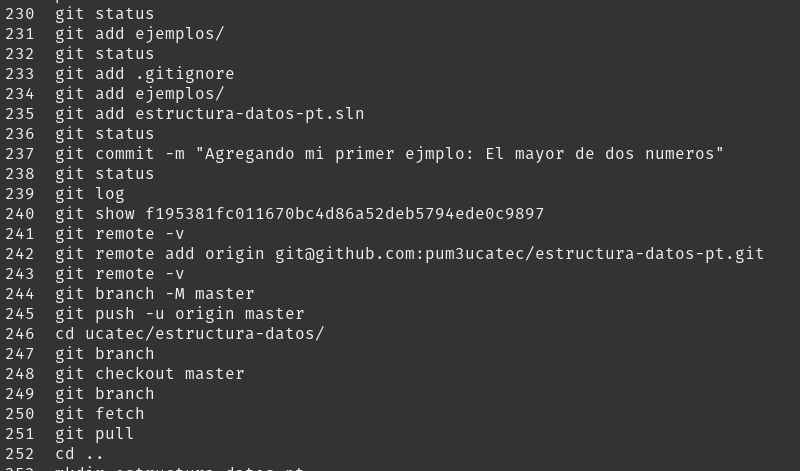

# ESTRUCUTURA DE DATOS

## Docente: Ing. Gaston Genaro Quelali Calcina

**Objetivo:** Repositorio que contiene los examenes, practicas y ejemplos de la materia

#### Enlaces importantes

- [Pregrado UCATEC](https://pregrado.ucatec.edu.bo)
- [Markdown](https://markdown.es)

1. Para listar los archivos ocultos en `git bash`

```
ls -la
```

2. Tambien puedes viaulizar el historico de comandos con `history` el resultado es el siguiente:


