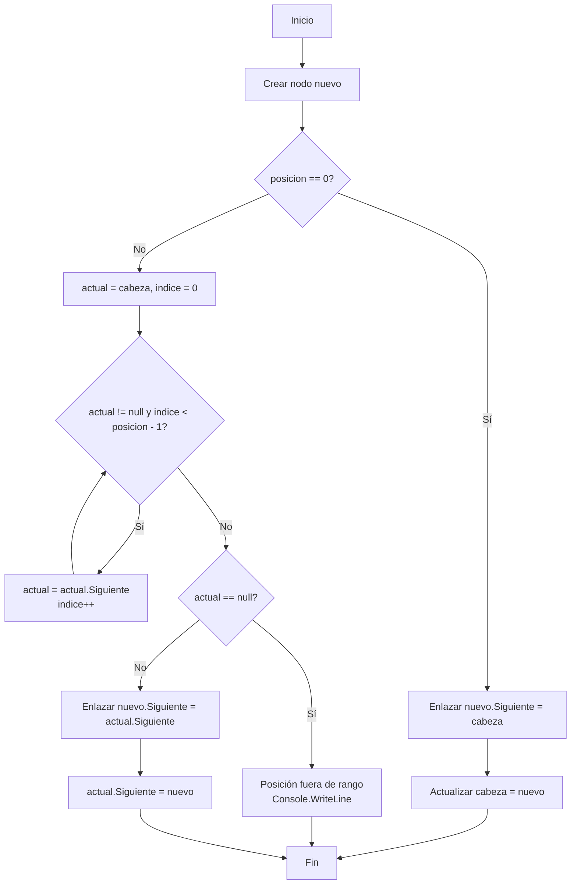

# Ejamplo de diagrama para ....

```mermaid
flowchart TD

A[Inicio] --> B[Crear nodo nuevo]
B --> C{posicion == 0?}

C -- Sí --> D[Enlazar nuevo.Siguiente = cabeza]
D --> E[Actualizar cabeza = nuevo]
E --> F[Fin]

C -- No --> G[actual = cabeza, indice = 0]
G --> H{actual != null y indice < posicion - 1?}

H -- Sí --> I[actual = actual.Siguiente<br/>indice++]
I --> H

H -- No --> J{actual == null?}
J -- Sí --> K[Posición fuera de rango<br/>Console.WriteLine]
K --> F

J -- No --> L[Enlazar nuevo.Siguiente = actual.Siguiente]
L --> M[actual.Siguiente = nuevo]
M --> F[Fin]

```

# Ejemplo de datos

```mermaid
A → B → C → D → null
```

```mermaid
A → B → X → C → D → null
```
