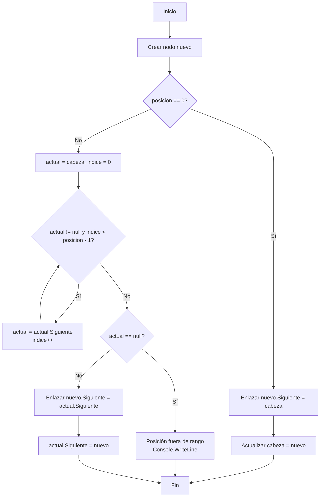

# Ejamplo de diagrama para ....

# Ejemplo de datos

flowchart LR
    H["HEAD"]:::head --> A["A"]:::nodo
    A --> B["B"]:::nodo
    B --> C["C"]:::nodo
    C --> D["D"]:::nodo
    D --> N["null"]:::null

    classDef head fill:#2196F3,stroke:#0D47A1,color:#fff,stroke-width:2px;
    classDef nodo fill:#4CAF50,stroke:#2E7D32,color:#fff,stroke-width:2px;
    classDef null fill:#F44336,stroke:#B71C1C,color:#fff,stroke-width:2px;
