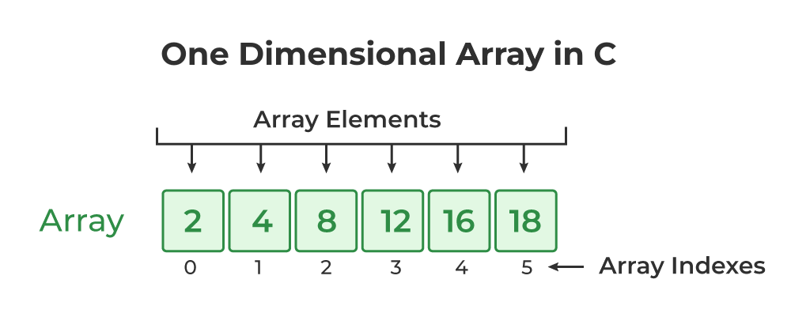

# PROGRAMA EN C# – NÚMERO FALTANTE EN UN ARREGLO

|| |
| --------------------------------------- | -----------------------------------------------------------------|
| Este proyecto en **C#** permite encontrar un número faltante dentro de una secuencia del `1` al `n`. El usuario ingresa el valor máximo esperado y los números disponibles (faltando uno), y el programa identifica cuál es el número que falta. | |

---

## Funcionamiento del programa
1. El usuario ingresa un valor `n`, que representa el número máximo esperado.  
2. Luego debe ingresar **n - 1 números** del 1 al n, separados por espacios.  
3. El programa valida la entrada, vuelve a pedir los datos si hay error, y finalmente calcula el número faltante.  

Ejemplo de ejecución:  

Ingresa el valor de n (máximo número esperado):
5

Escribe 4 números del 1 al 5, separados por espacio (uno faltará):
1 2 3 5

El número que falta es: 4


---

## Código en C#
```csharp
using System;

class Program
{
    // Función que calcula el número faltante en el arreglo
    static int EncontrarNumeroFaltante(int[] numeros, int n)
    {
        int sumaEsperada = (n * (n + 1)) / 2; // Suma total esperada del 1 al n
        int sumaActual = 0;

        for (int i = 0; i < numeros.Length; i++)
        {
            sumaActual += numeros[i];
        }

        return sumaEsperada - sumaActual; // La diferencia es el número que falta
    }

    static void Main()
    {
        Console.WriteLine("Ingresa el valor de n (máximo número esperado):");
        int n = int.Parse(Console.ReadLine());

        int[] arregloConFalta = null;
        bool entradaValida = false;

        // Bucle que sigue pidiendo los números hasta que la cantidad sea correcta
        while (!entradaValida)
        {
            Console.WriteLine($"Escribe {n - 1} números del 1 al {n}, separados por espacio (uno faltará):");
            string input = Console.ReadLine();

            // Convertir lo ingresado a arreglo de enteros
            string[] partes = input.Split(' ', StringSplitOptions.RemoveEmptyEntries);
            arregloConFalta = new int[partes.Length];

            try
            {
                for (int i = 0; i < partes.Length; i++)
                {
                    arregloConFalta[i] = int.Parse(partes[i]);
                }

                // Validar que realmente se hayan puesto n-1 números
                if (arregloConFalta.Length != n - 1)
                {
                    Console.WriteLine($"Error: Debes ingresar exactamente {n - 1} números.\n");
                }
                else
                {
                    entradaValida = true; // Todo bien, salimos del bucle
                }
            }
            catch
            {
                Console.WriteLine("Error: Asegúrate de ingresar solo números válidos.\n");
            }
        }

        // Calcular y mostrar el número faltante
        int resultado = EncontrarNumeroFaltante(arregloConFalta, n);
        Console.WriteLine("\nEl número que falta es: " + resultado);
    }
}
 ```
# Explicación breve

Se usa la fórmula de la suma de Gauss:

sumaEsperada = (n * (n + 1)) / 2


Se calcula la suma de los números ingresados por el usuario.

La diferencia entre la suma esperada y la suma real es el número faltante.

## Características

- Valida si el usuario ingresa mal la cantidad de números.

- Maneja errores de conversión cuando no se colocan números válidos.

- Devuelve siempre el número faltante.