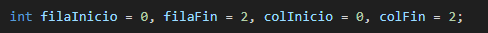

 HEAD
# Pregunta 1
## ESPIRAL DE UNA  MATRIZ
=======
## Pregunta 1
198f0509620789d980ddc3715bbc910f7e2512db

### Ejercicio:
Espiral en una Matriz
Escribe un programa que recorra e imprima los elementos de una matriz en forma de espiral.  
Ejemplo:  
```
[ [1, 2, 3],
  [4, 5, 6],
  [7, 8, 9] ]
```
 HEAD
→ `[1, 2, 3, 6, 9, 8, 7, 4, 5]`.

 ## *Declaraciòn de la matriz*


 - SE declara una matriz de 3x3 de tipo int.
 - Cada fila y columna contirnr valores enteros para poder hacerlo correr. 

 ## *Inicializaciòn de los limites*
 

 #### ·  FilaInicio → índice de la primera fila que aún no se ha recorrido 
  #### ·  filaFin → índice de la última fila que aún no se ha recorrido
 #### · colInicio → índice de la primera columna que aún no se ha recorrido.
#### · colFin →  índice de la última columna que aún no se ha recorrido.
#### · Estos límites se van actualizando a medida que se recorren filas y columnas.

 ## *Recorrido en espiral (bucle)*
 
 ·  El bucle while va a seguir continuando mientras estan filas y columnas.

1) Recorrer la fila superior (Izquierda - Derecha)
2) Recorrer la columna derecha (Arriba - Abajo)
3) Recorrer la fila inferior (Derecha - Izquierda)
4) Recorrer la columna izquierda (Abajo - Arriba)

 ## *Resultado Final*
 

lo primero es definir los limites de la matriz en filas y columnas, recorremos fila superior, columna derecha, fila inferior, columna izquierda, ajustamos los limites despues de cda recorrido y asi sucesivamente  con todos los elementos. 

### Camii :)
=======
→ `[1, 2, 3, 6, 9, 8, 7, 4, 5]`.
198f0509620789d980ddc3715bbc910f7e2512db
