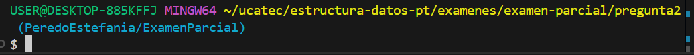

# **Pregunta 2** - *Encontrar el numero que falta* 
*En un arreglo de numeros del 1 al n, falta un numero. Encuentra cual es.*

*Ejemplo:*
<pre>[1,2,4,5,6]</pre>
→ Falta `3`.

**Estilo de nombrado:**

- Clase: → **PascalCase** ( `pregunta2`)
- Variables → **camelCase** (`n`, `arr`, `total`, `sumaArr`, `num`).

---
## **1. Descripcion**

Este programa solicita al usuario ingresar primero el tamaño de un arreglo y luego los numeros que tendra este mismo, con la condicion de que falte un numero.

El programa utiliza la **fórmula de suma de una serie aritmetica** `(n+1) * (n+2) / 2` para calcular cual es el numero que falta en la secuencia.

## **2. Flujo del programa**
1. Se solicita al usuario ingresar el tamaño del arreglo `n`
2. El usuario ingresa `n` numeros consecutivos (del 1 al `n+1`, pero faltando uno)
3. Se calcula la suma total esperada con la formula
4. Se calcula la suma real de los numeros ingresados
5. La diferencia que hay entre ambas sumas corresponde al numero que falta

## **3. Ejecución**
1. Entramos a la carpeta del ejercicio en la terminal, asi como se ve en la imagen:

2. Ahora ingresamos el siguiente comando:
    <pre>dotnet run</pre>
3. Ingresamos los datos de la siguiente manera:
    <pre>Ingrese el tamaño del arreglo: 5
    Ingrese los números del arreglo (del 1 al 5, faltando uno):
    (un numero en cada linea)
    1
    2
    4
    5
    6</pre>
4. Despues se debera mostrar el siguiente resultado:
    <pre>El número faltante es: 3</pre>