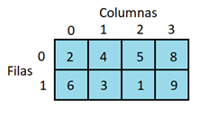

# PROGRAMA EN C# – RECORRIDO EN ESPIRAL DE UNA MATRIZ

|| |
| --------------------------------------- | -----------------------------------------------------------------|
| Este proyecto en **C#** permite recorrer una matriz y mostrar sus elementos en **forma de espiral**. La matriz es fija en el código y el programa devuelve una lista ordenada con el recorrido en espiral. | |

---

## Funcionamiento del programa
1. Se define una matriz de enteros fija en el código.  
2. El algoritmo recorre la matriz en espiral, comenzando desde la esquina superior izquierda.  
3. El resultado se imprime en consola en el orden recorrido.  

Ejemplo de ejecución:  

Recorrido en espiral:
[ 1, 2, 3, 6, 9, 8, 7, 4, 5 ]

pgsql
Copiar
Editar

---

## Código en C#
```csharp
using System;
using System.Collections.Generic;

class Program
{
    // Recorre la matriz en forma de espiral y devuelve los valores en una lista
    static List<int> RecorrerEspiral(int[,] matriz)
    {
        List<int> recorrido = new List<int>();
        int arriba = 0, abajo = matriz.GetLength(0) - 1;
        int izquierda = 0, derecha = matriz.GetLength(1) - 1;

        while (arriba <= abajo && izquierda <= derecha)
        {
            // fila de izquierda a derecha
            for (int j = izquierda; j <= derecha; j++)
                recorrido.Add(matriz[arriba, j]);
            arriba++;

            // columna de arriba hacia abajo
            for (int i = arriba; i <= abajo; i++)
                recorrido.Add(matriz[i, derecha]);
            derecha--;

            // fila de derecha a izquierda
            if (arriba <= abajo)
            {
                for (int j = derecha; j >= izquierda; j--)
                    recorrido.Add(matriz[abajo, j]);
                abajo--;
            }

            // columna de abajo hacia arriba
            if (izquierda <= derecha)
            {
                for (int i = abajo; i >= arriba; i--)
                    recorrido.Add(matriz[i, izquierda]);
                izquierda++;
            }
        }

        return recorrido;
    }

    static void Main()
    {
        // La matriz fija
        int[,] matriz = { { 1, 2, 3 }, { 4, 5, 6 }, { 7, 8, 9 } };

        // El resultado en espiral
        List<int> resultado = RecorrerEspiral(matriz);
        Console.WriteLine("Recorrido en espiral:");
        Console.WriteLine("[ " + string.Join(", ", resultado) + " ]");
    }
}
```
# Explicación breve
Se usan cuatro variables (arriba, abajo, izquierda, derecha) que delimitan los bordes de la matriz.

El algoritmo recorre en este orden:

👉 De izquierda a derecha.

👇 De arriba hacia abajo.

👈 De derecha a izquierda.

☝️ De abajo hacia arriba.

En cada vuelta los bordes se ajustan y el proceso se repite hasta recorrer todos los elementos.

## Características
Recorre cualquier matriz rectangular, no solo cuadrada.

El recorrido siempre comienza en la esquina superior izquierda.

Devuelve una lista ordenada en espiral con todos los elementos.