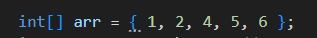
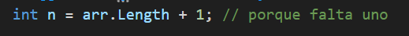
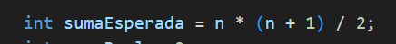
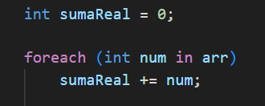
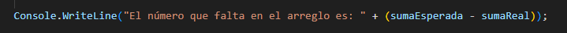
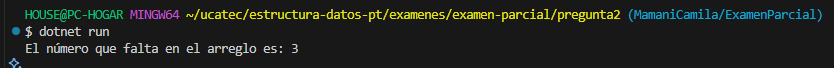

# Pregunta 2
## ENCONTRAR EL NUMERO QUE FALTA

### Ejercicio:
 Encontrar el Número que Falta En un arreglo de números del 1 al n, falta un número. Encuentra cuál es. Ejemplo: [1, 2, 4, 5, 6] → Falta 3.

## *Declaraciòn del arreglo*

· Se declara un arreglo de enteros llamado arr.
· Este arreglo contiene numeros consecutivos del 1 al n, pero falta un numero. 

## *Determinar el tamaño esperado*

· arr.Length devuelve la cantidad de elementos actuales, en ejm: 5

· Como falta un nùmero el tamaño total esperado de la secuencia seria 6, por eso sumamos +1

## *Calcular la suma esperada*

## *Calcular la suma real del arreglo*

· Se recorre cada nùmero del arreglo y se suma en sumaReal.

## *Encontrar el nùmero faltante*

## *Resultado Final*

### Camii :)

