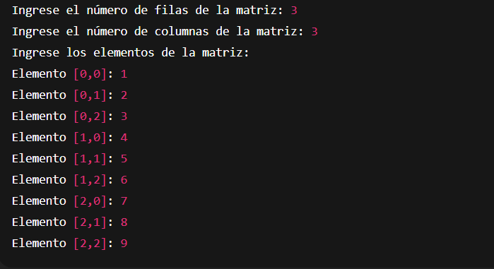
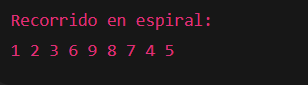

# **Pregunta 1** – Espiral en una Matriz

**Estilo de nombrado**
- **Clase (PascalCase):** `Pregunta1`  
- **Variables (snake_case):** `num_filas`, `num_columnas`, `inicioFila`, `inicioCol`  
- **Método (PascalCase):** `ImprimirEspiral`

---

## 1. Descripción

Este programa construye una **matriz** ingresada por teclado y luego recorre sus elementos en **forma de espiral**, imprimiéndolos en ese orden.

El recorrido se hace así:
1. Izquierda → derecha (primera fila disponible)  
2. Arriba → abajo (última columna disponible)  
3. Derecha → izquierda (última fila disponible)  
4. Abajo → arriba (primera columna disponible)  

Se repite reduciendo bordes hasta visitar todos los elementos.



---

## 2. Flujo del programa

1. Solicitar al usuario el número de filas (`num_filas`) y columnas (`num_columnas`).  
2. Leer los elementos y llenar la matriz.  
3. Llamar al método `ImprimirEspiral(matriz, num_filas, num_columnas)`, que usa:
   - `inicioFila` y `inicioCol` como bordes superiores/izquierdos.
   - `num_filas` y `num_columnas` como bordes inferiores/derechos (se van reduciendo).
4. Imprimir el recorrido en espiral.

📷 **Diagrama de flujo del programa**  


---

## 3. Ejecución

1. En la terminal, ubícate en la carpeta del proyecto.  
2. Ejecuta:
   ```bash
   dotnet run
