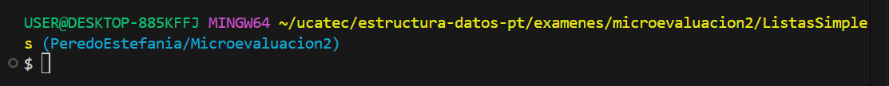

# **MICROEVALUACION 2**

# **Lista Simple** - *Insertar al principio y Eliminar alrededor de un Nombre*  


**Estilo de nombrado:**

- Clase → **PascalCase** (`Nodo`, `Lista`, `Program`)  
- Variables → **camelCase** (`cabeza`, `actual`, `temp`, `nombreEliminar`)  
- Métodos → **PascalCase** (`InsertarAlPrincipio`, `EliminarAlrededor`, `View`)  

---

## **1. Descripción**

Este proyecto implementa una **lista enlazada simple de nombres (strings)** en C#

La lista soporta las siguientes operaciones:  
1. **Insertar al principio** → Agrega un nuevo nodo con un nombre al inicio de la lista.  
2. **Eliminar alrededor de un valor** → Busca un nodo por su nombre y elimina el **nodo anterior** y el **nodo siguiente**, si existen
3. **Mostrar lista** → Recorre todos los nodos e imprime los nombres almacenados.  

---

## **2. Flujo del programa**

1. El usuario interactúa mediante un menú en consola
2. Si selecciona `1`, puede ingresar un nombre que será insertado al inicio de la lista  
3. Si selecciona `2`, se pide un nombre y se elimina el nodo anterior y posterior al mismo (si existen)
4. Si selecciona `3`, se imprimen todos los nombres de la lista
5. El ciclo continúa hasta que el usuario ingrese la opción `0` (salir)

---

## **3. Archivos**

* **Nodo.cs**
  Define la estructura del nodo con dos atributos:

  * `Nombre` → el valor almacenado (string)
  * `Next` → referencia al siguiente nodo

* **Lista.cs**
  Implementa la lógica principal de la lista:

  * `InsertarAlPrincipio(string nombre)`
  * `EliminarAlrededor(string nombre)`
  * `View()`

* **Program.cs**
  Contiene el menú principal que permite al usuario interactuar con la lista

---

## **4. Ejecución**

1. Entramos a la carpeta del proyecto desde la terminal:  


2. Escribimos el siguiente comando para ejecutar:  
   <pre>
   dotnet run
</pre>

3. Se muestra el menú principal:

   ```
   --- MENU LISTA SIMPLE ---
   1. Insertar nombre al principio
   2. Eliminar alrededor de un nombre
   3. Mostrar lista
   0. Salir
   ```

4. Ejemplo de uso:

   * Insertamos: `Juan, Ana, Pedro, Luis`
   * La lista queda:

     <pre>
     Luis | Pedro | Ana | Juan |
     </pre>
   * Si eliminamos alrededor de `Pedro`, la salida será:

     <pre>
     El nombre Luis fue eliminado de la lista
     El nombre Ana fue eliminado de la lista
     </pre>
   * Nueva lista:

     <pre>
     Pedro | Juan |
     </pre>
