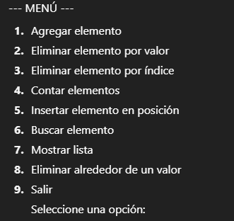
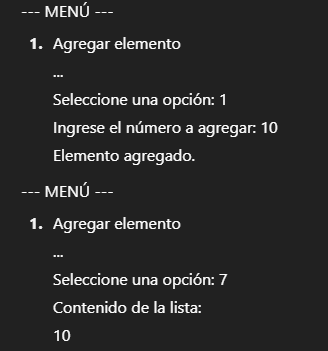

#  Programa en C#: Menú de Operaciones con Listas

Este programa en **C#** permite manipular una lista de números enteros mediante un menú interactivo en consola.  

Se pueden realizar operaciones como agregar, eliminar, buscar, contar e insertar elementos.  
También tiene una opción especial para **eliminar los elementos alrededor de un valor dado**.

---

##  Menú Principal

Cuando se ejecuta el programa, aparece el siguiente menú:

El usuario debe ingresar el número de la opción que desea ejecutar.

---

##  Funcionalidades del Menú

### **1. Agregar elemento**
- Permite agregar un número al final de la lista.  
- Ejemplo: si la lista es `[2, 4]` y agrego `7`, la lista queda `[2, 4, 7]`.

---

### **2. Eliminar elemento por valor**
- Elimina la **primera aparición** de un número en la lista.  
- Si no existe, muestra el mensaje *"Elemento no encontrado."*.

Ejemplo:  
Lista `[2, 4, 7]`  
Eliminar `4` → Resultado: `[2, 7]`.

---

### **3. Eliminar elemento por índice**
- Permite eliminar un elemento según su **posición en la lista** (inicia en 0).  
- Si el índice no existe, muestra *"Índice fuera de rango."*.

Ejemplo:  
Lista `[2, 7]`  
Eliminar en índice `1` → Resultado: `[2]`.

---

### **4. Contar elementos**
- Muestra cuántos elementos hay en la lista.  

Ejemplo:  
Lista `[2, 5, 9]` → Cantidad: `3`.

---

### **5. Insertar elemento en posición**
- Inserta un número en una posición específica.  
- Si la posición es inválida, muestra error.  

Ejemplo:  
Lista `[2, 5, 9]`  
Insertar `7` en posición `1` → `[2, 7, 5, 9]`.

---

### **6. Buscar elemento**
- Busca un número en la lista y muestra el **índice donde se encuentra**.  
- Si no existe, muestra *"Elemento no encontrado."*.  

Ejemplo:  
Lista `[2, 7, 5, 9]`  
Buscar `5` → encontrado en índice `2`.

---

### **7. Mostrar lista**
- Muestra todos los elementos de la lista en orden.  
- Si está vacía, muestra *"(Lista vacía)"*.

Ejemplo:  
Lista `[2, 7, 5, 9]`  
Salida: 

 

---

### **8. Eliminar alrededor de un valor**
- Busca un valor en la lista.  
- Si existe, elimina el **elemento anterior y el siguiente** (si existen).  

Ejemplo:  
Lista `[2, 7, 5, 9]`  
Eliminar alrededor de `7`:  
- Elimina el anterior `2`.  
- Elimina el siguiente `5`.  
Resultado → `[7, 9]`.

---

### **9. Salir**
- Termina la ejecución del programa.

---

## Ejemplo de Uso

---

## Conclusión
Este programa es un ejemplo práctico del uso de la clase **`List<T>` en C#**, mostrando cómo:
- Agregar, insertar y eliminar elementos.
- Contar y buscar valores.
- Manipular datos dinámicamente.

