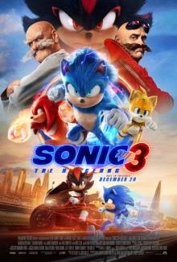
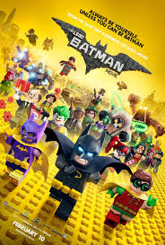

# Mi Biografía

## Sobre mí
Hola, mi nombre es **Jose Gabriel Loayza Barrera** y nací un 12 de octubre del año 2005 en el pais de Bolivia, en Cochabamba **Bolivia, Cochabamba, Cercado, Pacata Baja**.
!(https://www.google.com/url?sa=i&url=https%3A%2F%2Fwww.lostiempos.com%2Factualidad%2Flocal%2F20160801%2Fcrece-division-vecinos-pacata-conflicto-limites&psig=AOvVaw1WyZ5g4EyljwQYncX75mgj&ust=1756779232927000&source=images&cd=vfe&opi=89978449&ved=0CBUQjRxqFwoTCMCa_-S-to8DFQAAAAAdAAAAABAE)

Vivi toda mi vida en el pais de Bolivia, mi padre siendo de **de departamento de La Paz** y mi madre de **del departamento Cochabamba.**, mi hermana tambien es**del departamento de Cochabamba**

De niño amaba ver peliculas y documentales de **animales**, pero tambien le agarre un gran gusto a la **imaginacion** y que siempre me gustado estar mas por mi cuenta.

Un detalle de mi es que soy **autista**, un leve caso de **asperger** A la edad de **16 años** mis padres decidieron revelarme esta informacion, al incio no les crei pero me doy cuenta gracias a ese detalle de porque muchas veces mi forma de pensar era diferente a la de los demas ya que en mi niñez no me gustaba jugar y moverme que los otros niños, pero aprendo a abrazar mi lado **autista**.

En un tiempo aprendi a ver detalles que me podrian ayudar, buscaba una actividad fisica que sepa gustarme, un detalle es que a mi no me gusta el **futbol**, lo intente con el **balocesto** pero no funciono, asi que fui por el **crossfit** una actividad fisica de fuerza y resistencia, esta al final me gusto y hasta el dia de hoy hago esta actividad.

## Mis estudios
He estudiado en algunos colegios en mi ciclo escolar desde primaria hasta la secundaria y actulmente estoy estudiando la carrera de **ingeniera en sistemas**.

### Etapas de mi educación
1. Escuela primaria en los colegios **Montessori, Guadalupano**
2. Secundaria en el **Colegio Paulo Freire**
3. Carrera universitaria en **UCATEC**

## Intereses
- MUSICA: Principalmente mi genero de musica es el genero del rock en general, pero tambien el pop, country, techno, k-pop, clasico y otro generos musicales.

    Algunas de mis canciones favoritas:

[NSYNC-bye bye bye] (https://youtu.be/Eo-KmOd3i7s?si=aGvhY1JNMJ978O_v)
[Linkin Park- numb] (https://youtu.be/kXYiU_JCYtU?si=RbNnc7MfTofPx_fX)
[Green day- Boulevard of broken dreams] (https://youtu.be/Soa3gO7tL-c?si=7HjlfCGu_Y1TpYj0)
[Tenacious - baby one more time] (https://youtu.be/5CcZ4ULT1Eo?si=wO7mg-cQtMd6cUeQ)
[Huntrix - golden] (https://youtu.be/UcPfjABPEiU?si=00UXDhYPbB0gGIqB)

---

- PELICULAS Y SERIES: Algo a destacar de mi es que soy muy cinefilo, amo todo lo relacionado al mundo del cine, me gusta mucho el cine de superheroes **marvel y dc**, la fantasia **disney**, ficcion**Universal y warner bross** y la animacion**disney, dreamworks, illumination, sony y todo sobre el anime**:

    
     
     
     
     
     
     
     
     
     
     
      
     
     
     
     
     
     
      
     
     
     
     
     
---
### Mis sueños
Tengo muchos sueños, uno es lograr salir de aqui con honores y sabiendo que pude aprender de todo lo que me enseñan y un objetivo a largo plazo en la creacion de un universo cinematografico donde pienso agregar todas mis visiones en historias que sepan conectar con el publico.
---
**Finalizo con una frase que me inspira mucho.**
> *"A veces lo que uno no pide o quiere es lo que mas necesita"*

