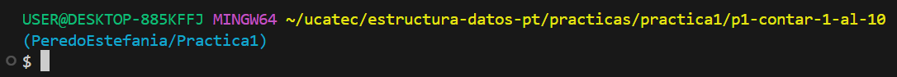

# **INDICE**
- [1. Descripcion](#1-descripcion)
	- [1.1. Contar del 1 al 10](#11-contar-del-1-al-10)
	- [1.2. Sumar números del 1 al N](#12-sumar-números-del-1-al-n)
	- [1.3. Tabla de multiplicar](#13-tabla-de-multiplicar)
	- [1.4. Menú con do-while](#14-menú-con-do-while)
	- [1.5. Cuenta regresiva](#15-cuenta-regresiva)
	- [1.6. Validar entrada con do-while](#16-validar-entrada-con-do-while)
	- [1.7. Suma de 5 números](#17-suma-de-5-números)
	- [1.8. Detectar número primo](#18-detectar-número-primo)
	- [1.9. Primeros 10 números pares](#19-primeros-10-números-pares)
	- [1.10.  Juego "Adivina el número"](#110-juego-adivina-el-número)

---

# 1. Descripcion

En este documento se explican los diferentes ejercicios básicos con **C#** que forman parte de la **Práctica 1** de la materia **Estructura de Datos**.  
Cada ejercicio se ejecuta en consola, mostrando el uso de ciclos, condicionales, validaciones y operaciones básicas.  

- **Ejecucion:**

1. Entramos a la carpeta del ejercicio en la terminal, como se ve en la imagen:
   
2. Ejecutamos el siguiente comando:
   <pre>
   dotnet run</pre>

**Estilo de nombrado:**

* **Clases** → PascalCase (`Ejercicio1`)
* **Variables** → snake\_case (`num_secreto`, `num_intento`)
* **Métodos** → PascalCase (`SumarHastaN`)

---

## 1.1. Contar del 1 al 10

Muestra en pantalla los números del 1 al 10.

**Flujo del programa:**

1. Se utiliza un bucle que empieza en 1.
2. Se incrementa hasta 10.
3. En cada iteración se imprime el valor.

**Métodos usados:**

* Bucle `for`
* `Console.WriteLine` para mostrar datos

---

## 1.2. Sumar números del 1 al N

El usuario introduce un número `N` y el programa calcula la suma de todos los números desde 1 hasta `N`.

**Flujo del programa:**

1. Se solicita un número entero al usuario.
2. Se acumula la suma con un ciclo hasta `N`.
3. Se muestra el resultado en consola.

**Métodos usados:**

* Entrada con `Console.ReadLine`
* Conversión con `int.Parse`
* Bucle `while`
* Variable acumuladora

---

## 1.3. Tabla de multiplicar

Se pide un número y se muestra su tabla de multiplicar del 1 al 10.

**Flujo del programa:**

1. El usuario ingresa un número.
2. Un ciclo recorre del 1 al 10.
3. Se multiplica en cada iteración y se imprime el resultado.

**Métodos usados:**

* Bucle `for`
* Entrada de datos y `Console.WriteLine`

---

## 1.4. Menú con do-while

Se muestra un menú con opciones (saludar, sumar, salir). El menú se repite hasta que el usuario elija salir.

**Flujo del programa:**

1. Se utiliza un bucle `do-while` que mantiene el menú activo.
2. El usuario selecciona una opción.
3. Se ejecuta la acción correspondiente.

**Métodos usados:**

* Bucle `do-while`
* Condicionales `if` / `else if`
* Entrada con `Console.ReadLine`

---

## 1.5. Cuenta regresiva

Muestra una cuenta regresiva desde 10 hasta 1.

**Flujo del programa:**

1. Un contador inicia en 10.
2. Se decrementa en cada paso.
3. Se imprime en pantalla hasta llegar a 1.

**Métodos usados:**

* Bucle `while`

---

## 1.6. Validar entrada con do-while

El programa pide un número positivo y no permite continuar hasta que el usuario ingrese un valor válido.

**Flujo del programa:**

1. Se solicita un número.
2. El ciclo se repite mientras sea negativo o cero.
3. Solo cuando es válido termina el bucle.

**Métodos usados:**

* Bucle `do-while`
* Conversión `int.Parse`

---

## 1.7. Suma de 5 números

Solicita 5 números al usuario y los suma.

**Flujo del programa:**

1. Un ciclo itera cinco veces.
2. Se pide un número en cada repetición.
3. Se acumula la suma en una variable.
4. Se muestra el total.

**Métodos usados:**

* Bucle `for`
* Variable acumuladora
* Entrada con `Console.ReadLine`

---

## 1.8. Detectar número primo

Verifica si un número ingresado es primo.

**Flujo del programa:**

1. El usuario ingresa un número.
2. El programa prueba divisibilidad desde 2 hasta n-1.
3. Si encuentra un divisor, no es primo.
4. Caso contrario, es primo.

**Métodos usados:**

* Bucle `for`
* Condicionales `if`
* Variable booleana para estado

---

## 1.9. Primeros 10 números pares

Muestra los primeros 10 números pares en consola.

**Flujo del programa:**

1. Se inicia con el número 2.
2. Se suma 2 en cada paso.
3. Se repite hasta obtener 10 valores.

**Métodos usados:**

* Bucle `while`
* Variable contador

---

## 1.10.  Juego "Adivina el número"

Juego donde el usuario debe adivinar un número aleatorio generado por el programa.

**Flujo del programa:**

1. Se genera un número aleatorio del 1 al 50.
2. El usuario intenta adivinarlo.
3. El programa indica si el número es mayor o menor.
4. El ciclo termina cuando acierta.

**Métodos usados:**

* Generación aleatoria con `Random`
* Bucle `do-while`
* Condicionales
* Contador de intentos

```

¿Quieres que en este mismo README también agregue un **apartado inicial** con tus datos (nombre, materia, práctica 1), como hicimos antes en el README general, o prefieres dejarlo directo con el índice y descripción?
```
