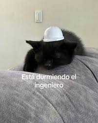

# Análisis de Recursividad: Contar Dígitos
Descripción del Programa
Este programa cuenta la cantidad de dígitos de un número entero utilizando un enfoque recursivo.

## **Función Recursiva Principal**
```
csharp
public static int ContarDigitosRecursivo(int n)
{
    // Caso base: si el número tiene un solo dígito
    if (n < 10)
        return 1;

    // Paso recursivo: se elimina el último dígito dividiendo entre 10
    return 1 + ContarDigitosRecursivo(n / 10);
}
```
## **Explicación de la Recursividad**
1. Caso Base
```
csharp
if (n < 10)
    return 1;
```
- **¿Qué hace?**

Detecta cuando el número tiene un solo dígito (0-9)

Retorna inmediatamente el valor 1

- **Importancia:** Este es el punto de parada que evita la recursión infinita

- **Ejemplos:**

ContarDigitosRecursivo(7) → retorna 1

ContarDigitosRecursivo(0) → retorna 1

## **2. Caso Recursivo**
```
csharp
return 1 + ContarDigitosRecursivo(n / 10);
```
- ¿Qué hace?

**1:** Cuenta el dígito actual

**n / 10:** Elimina el último dígito mediante división entera

**ContarDigitosRecursivo(n / 10)**: Llama recursivamente con el número reducido

Descomposición matemática:
```
text
ContarDigitos(123) = 1 + ContarDigitos(12)
ContarDigitos(12)  = 1 + ContarDigitos(1)
ContarDigitos(1)   = 1 (caso base)
Visualización de la Ejecución
Ejemplo: ContarDigitosRecursivo(123)
text
Pila de llamadas:
─────────────────────────────────
1ª llamada: ContarDigitosRecursivo(123)
│   n = 123 → 123 >= 10 → va al caso recursivo
│   → return 1 + ContarDigitosRecursivo(12)
│
2ª llamada: ContarDigitosRecursivo(12)
│   n = 12 → 12 >= 10 → va al caso recursivo
│   → return 1 + ContarDigitosRecursivo(1)
│
3ª llamada: ContarDigitosRecursivo(1)
│   n = 1 → 1 < 10 → CASO BASE
│   → return 1
│
─────────────────────────────────
Resolución en reversa:
3ª llamada retorna: 1
2ª llamada retorna: 1 + 1 = 2
1ª llamada retorna: 1 + 2 = 3
─────────────────────────────────
Resultado final: 3
```


**Gracias por ver**