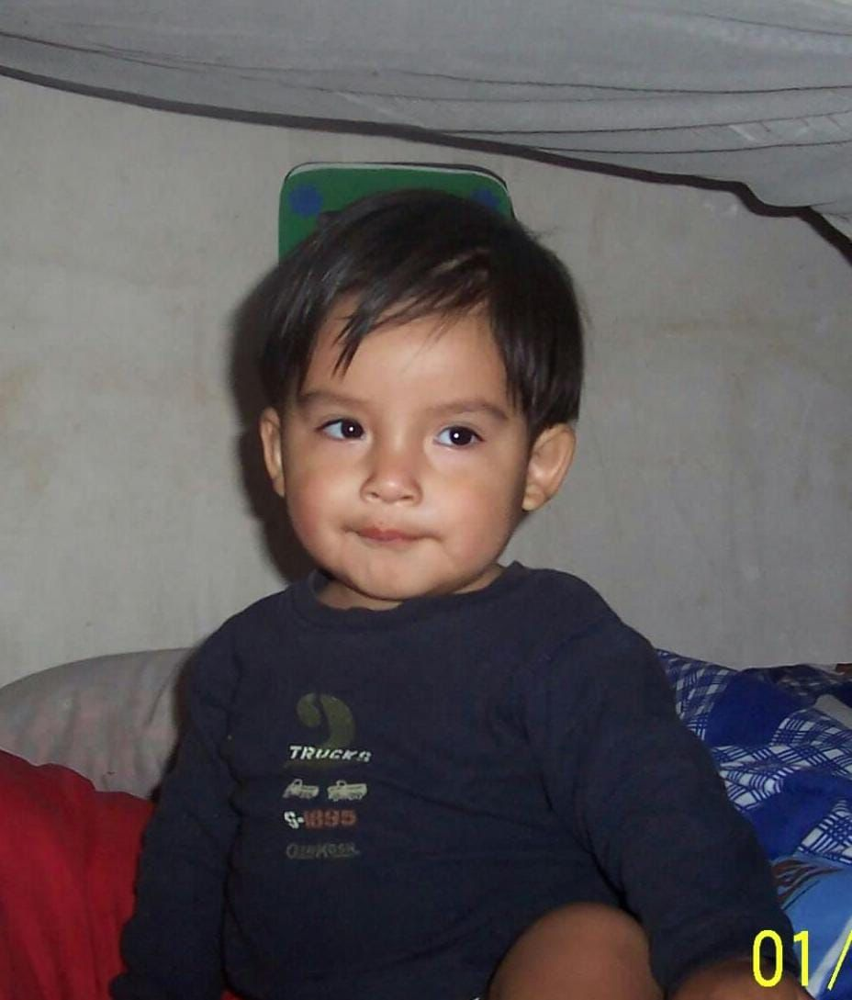
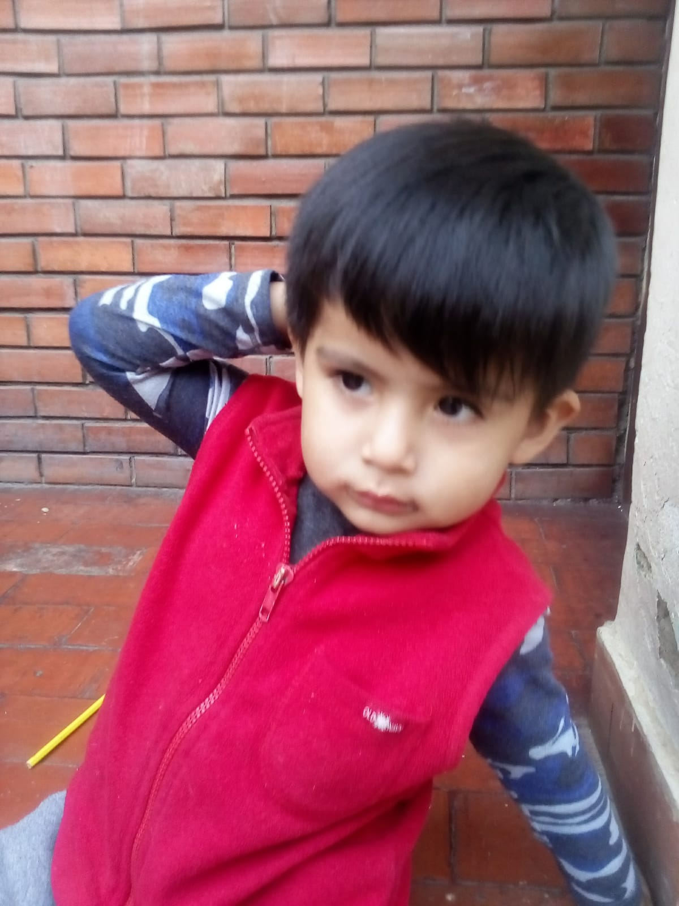
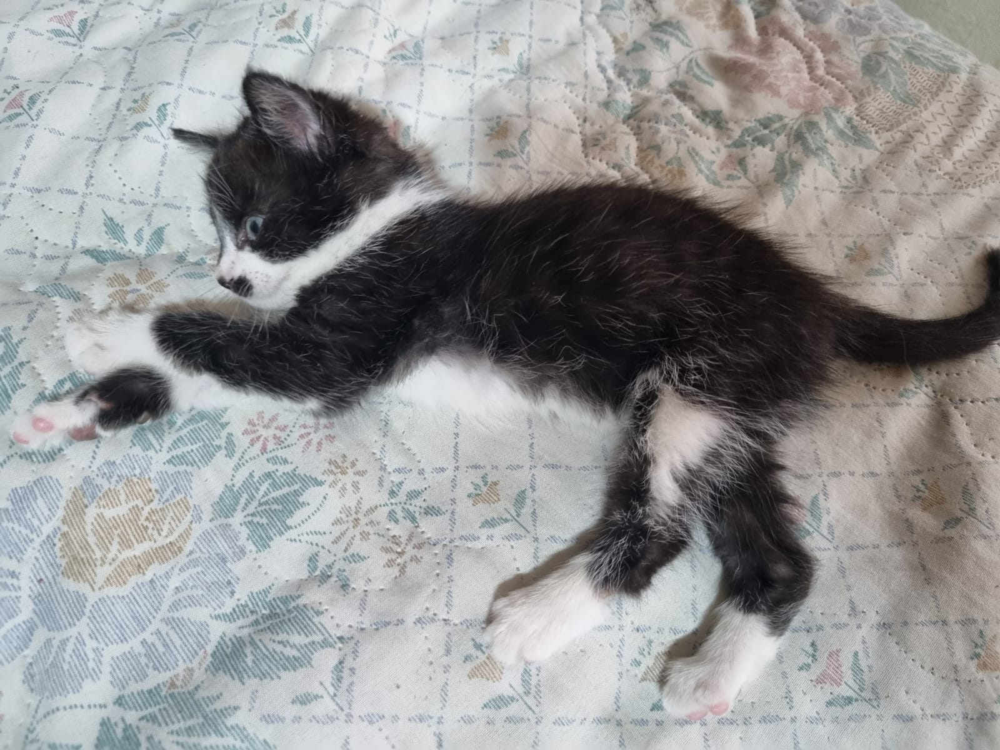
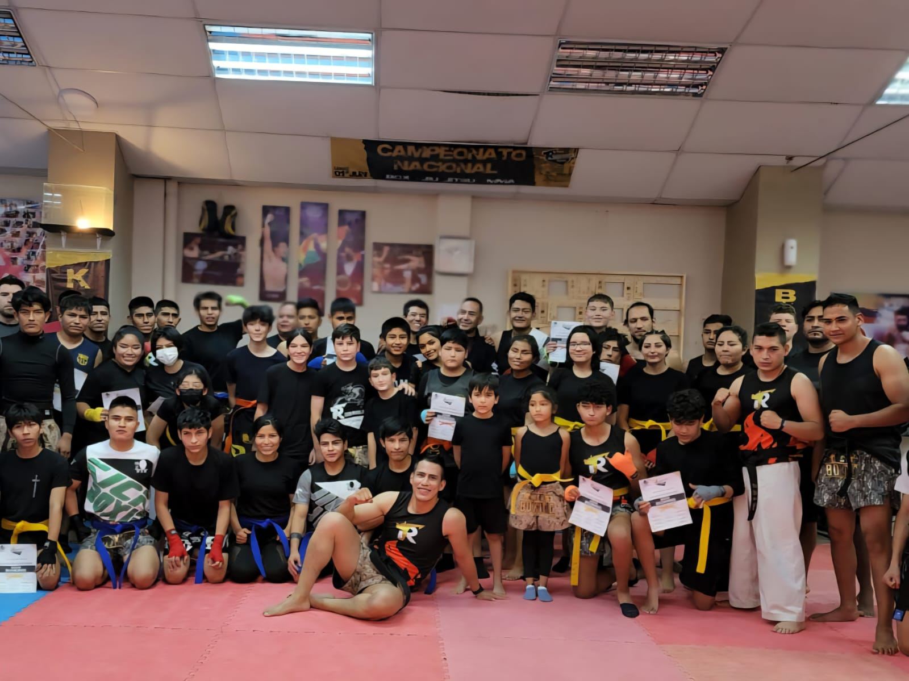

# Biografía de Adrien Liev Condarco Gonzales

## Información Personal

- *Nombre completo:* Adrien Liev Condarco Gonzales
- *Edad:* 19 años
- *Fecha de nacimiento:* 31 de mayo de 2006
- *Lugar de nacimiento:* Cercado, Cochabamba, Bolivia
- *Colegio:* Mariano Ricardo Terrazas, promoción 2023
- *Carrera:* Ingeniería de Sistemas
- *Distinciones:* Reconocido como mejor alumno de su clase

## Mi Familia

### Padres

- *Mamá:* Dania Gonzales Montaño  
- *Papá:* Juan Carlos Condarco Vásquez

### Hermanos

- Alondra Cossette Condarco Gonzales  
- Liam Jhosh Condarco Gonzales  
- Ethan Daniel Condarco Gonzales

## Mis Mascotas 🐱

Tengo dos gatos llenos de personalidad:

1. **Zafiro** – tranquila y observadora  
2. **Fígaro** – curioso y juguetón

## Mis Pasatiempos

- Ir al gimnasio o al dojo 🥋  
- Practicar artes marciales (boxeo, kickboxing —cinta marrón—, MMA, jiu jitsu) 🥊  
- Escuchar música de todo tipo y género 🎶  
- Leer poesía 📖  
- Aprender sobre nuevas tecnologías 💻  

## Datos Curiosos

- He practicado múltiples disciplinas de combate, lo que me ha enseñado disciplina, autocontrol y constancia.  
- Combino la fuerza física con el interés intelectual: tanto en el deporte como en la programación busco siempre la excelencia.  
- Disfruto de la poesía como forma de introspección y de la música como motor de energía diaria.

## Redes Sociales

- *Facebook:* [https://www.facebook.com/share/1ECTjt1GwW/]  
- *Instagram:* [https://www.instagram.com/adrihw_?igsh=dmtsdWNqMGk2NnF1]
- *GitHub:* [https://github.com/AdrienCondarcoG]  

---

> "El carácter no se puede desarrollar con tranquilidad y comodidad. Solo a través de la experiencia de la prueba y el sufrimiento se puede fortalecer el alma, inspirar la ambición y alcanzar el éxito."