# MI BIOGRAFIA

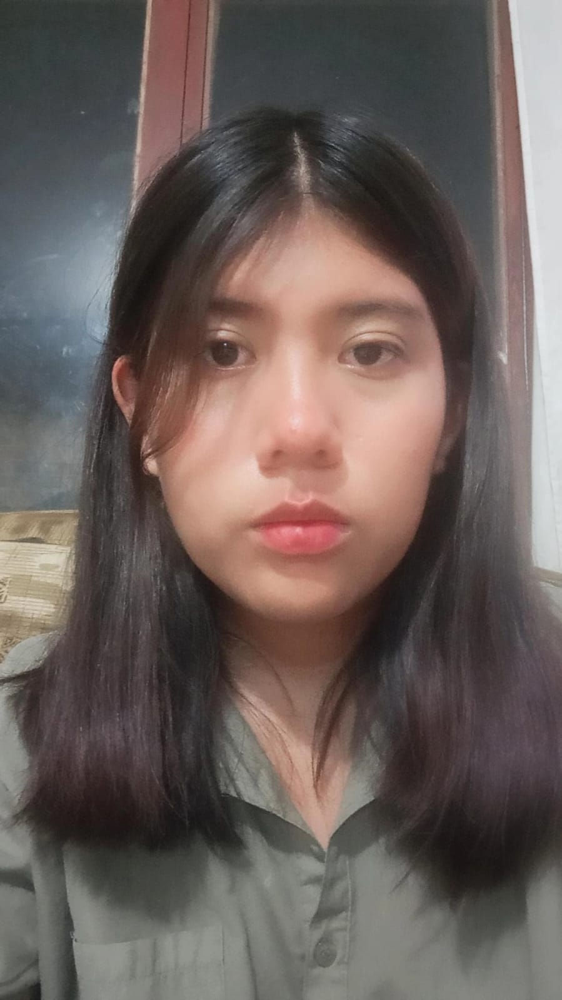

Mi nombre es **Paola Laurel Velasquez** naci el 5 de mayo del 2006, en **[Cochabamba-Bolivia](https://es.wikipedia.org/wiki/Cochabamba)**, desde primaria a secundaria aprendi a tocar instrumentos como la guitarra o violin, siendo este ultimo el de mi mayor preferencia, a pesar de esto no es algo que practique mucho actualmente, durante los ultimos años de secundaria descubri mi interes por la programacion en una conferencia sobre STEAM.

## Hobbies e intereses

### Lectura

---

Unos de mis pasatiempos favoritos es leer, en especial los de **_Xianxia, fantasia, accion y realismo magico_**

---

#### Lecturas preferidas

---

| 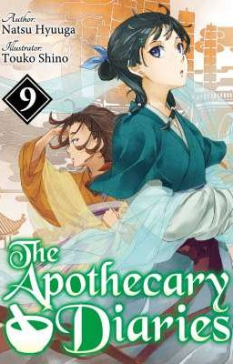 | 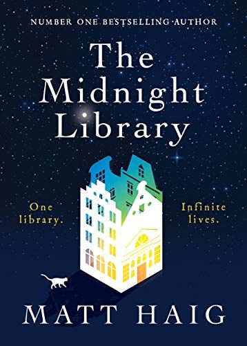 | 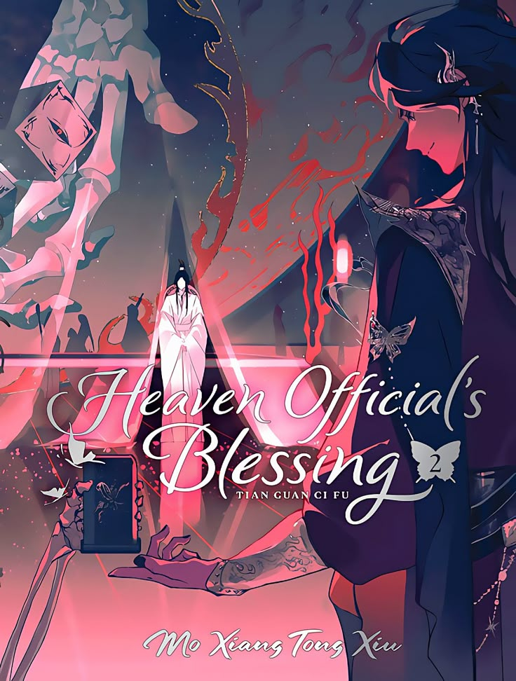 |
| --------------------------------------------------------- | ------------------------------------------------------ | -------------------------------------------------------- |
| The Apothecary Diaries                                    | The Midnight Library                                   | Heaven Official's Blessing                               |

---

### Música

---

Uno de mis generos favoritos es el **_Pop_**, este puede estar en cualquier idioma

---

#### Canciones preferidas

---

| 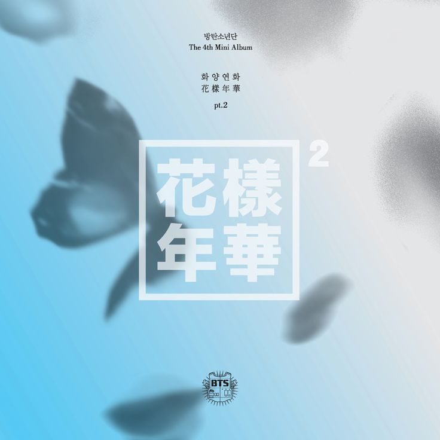 | 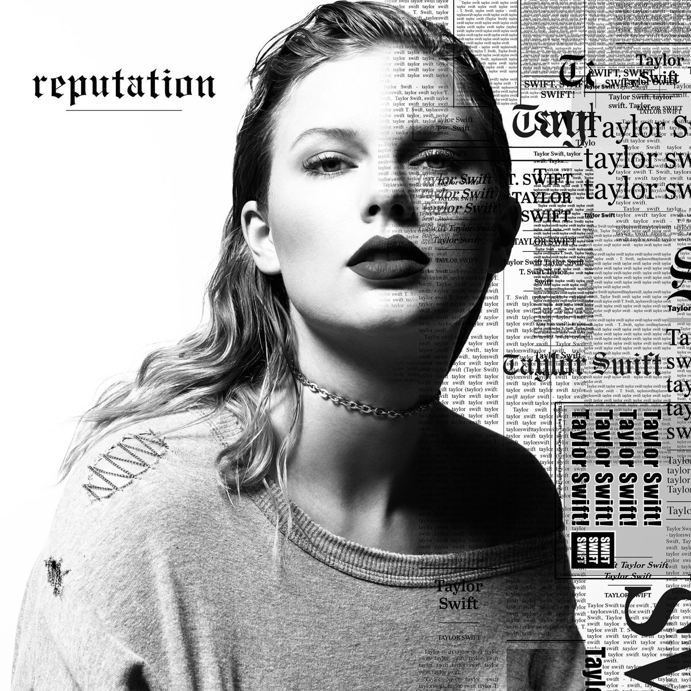  | 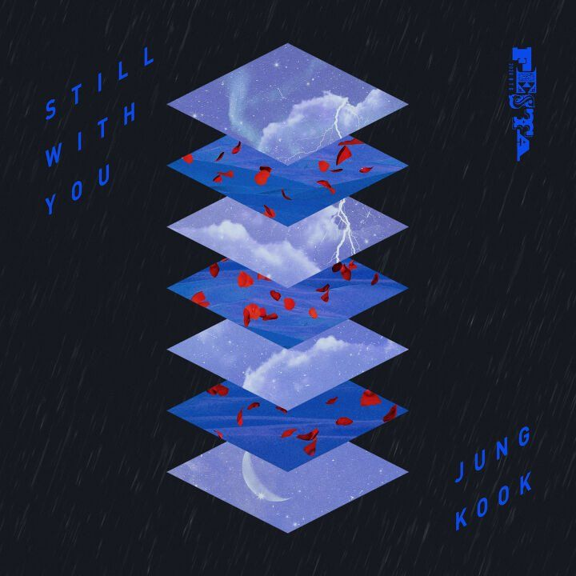 |
| -------------------------------------------------- | ---------------------------------------------------------- | ----------------------------------------------------------- |
| [Run - BTS](https://youtu.be/BiPKFk85iF4)          | [Getaway Car - Taylor Swift](https://youtu.be/FhPLQVlUiNQ) | [Still Whit You - Jungkook](https://youtu.be/BksBNbTIoPE)   |

---

---

| 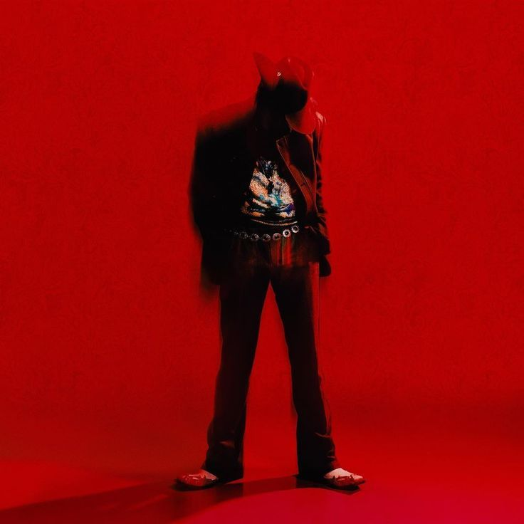 | 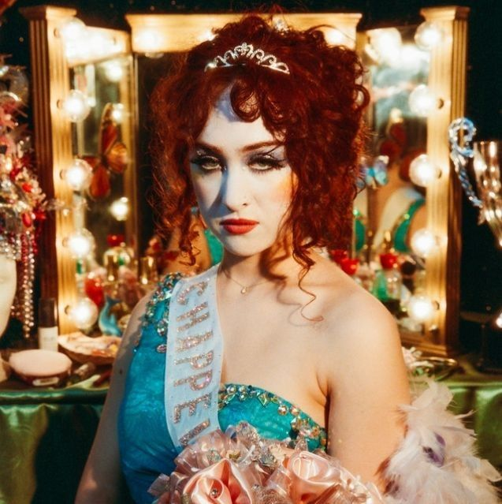       | 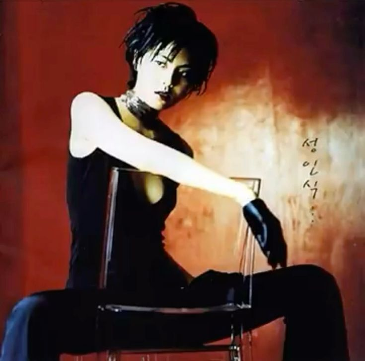  |
| ----------------------------------------------------- | ------------------------------------------------------------- | ------------------------------------------------------------- |
| [Calico - DPR IAN](https://youtu.be/attctO9YQnk)      | [Pink Pony Club - Chapell Roan](https://youtu.be/GR3Liudev18) | [Adult Ceremony - Park Ji Yoon](https://youtu.be/3s4Yr0meg8w) |

---

**_¡¡¡Mención especial a [The Rumbling - SiM](https://youtu.be/OBqw818mQ1E)!!!_**

---

### Series y animes

---

Aunque disfruto más leer sin duda tengo muchos favoritos en esta sección, ya sean adaptaciones de novelas ligeras que me gustan o simplemente algunos que llegaron aqui por su propia cuenta!!!

---

| 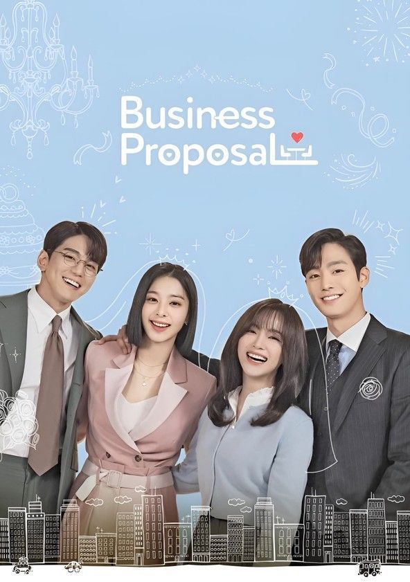 | 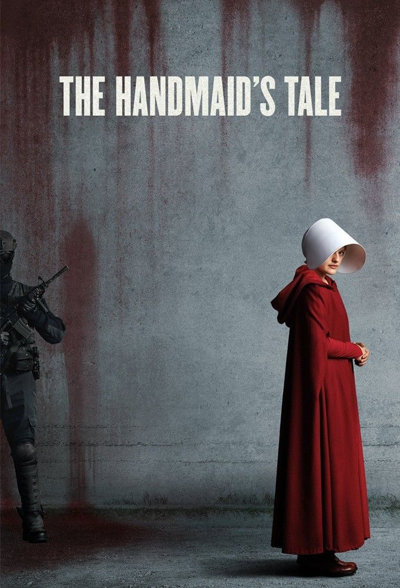 | 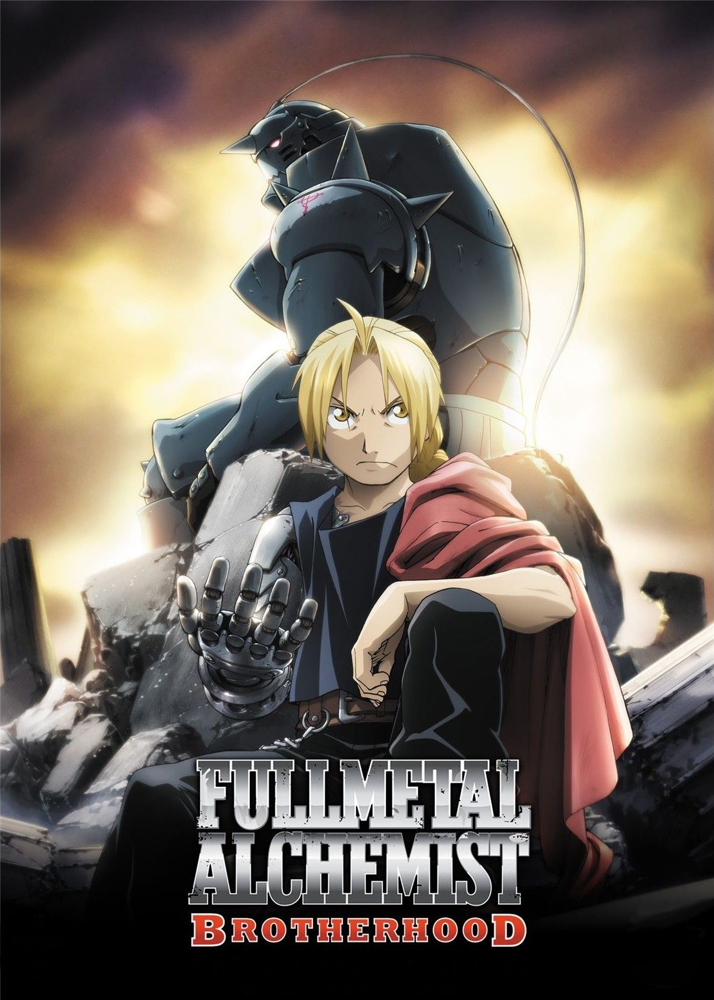 |
| ----------------------------------------------------------- | ---------------------------------------------------------- | ------------------------------------------------------- |
| Bussines Proposal                                           | El Cuento de la Criada                                     | Full Metal ALchemist Brotherhood                        |

---

---

| 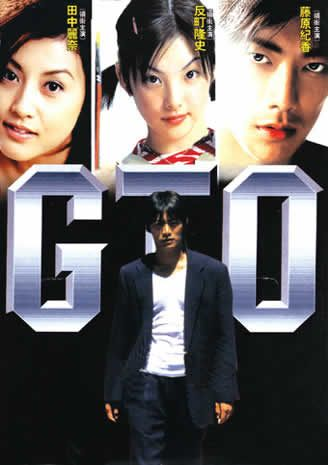 | 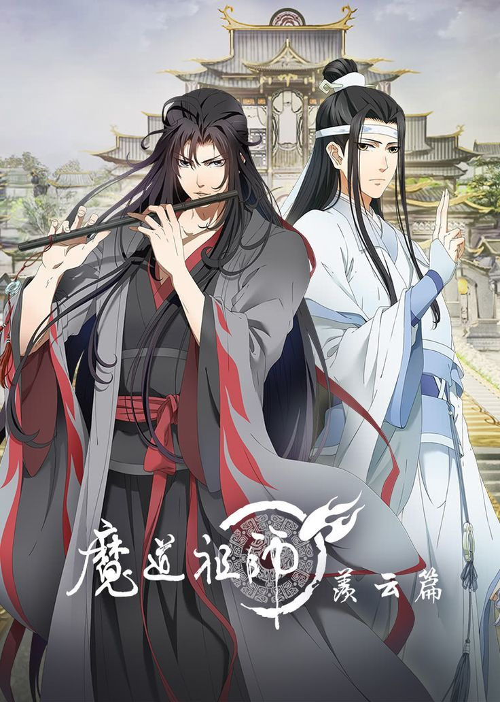 | 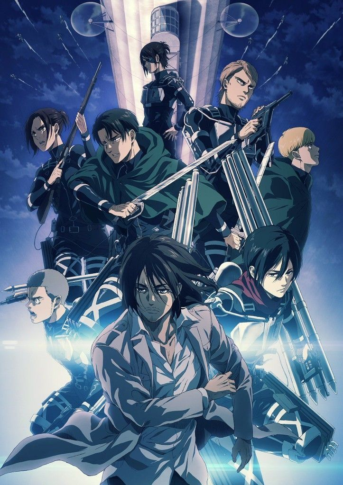 |
| ----------------------------------------------------- | ------------------------------------------------------ | ------------------------------------------------------- |
| Great Teacher Onisuka                                 | The Grand Master of the Demonic Cultivation            | Attack on Titan                                         |

---

**_¡¡¡Otra mencion especial!!!_** Aunque no esta en mis favoritos actuales **_Card Captor Sakura_** es sin duda uno muy especial para mi

---

### Peliculas

---

| 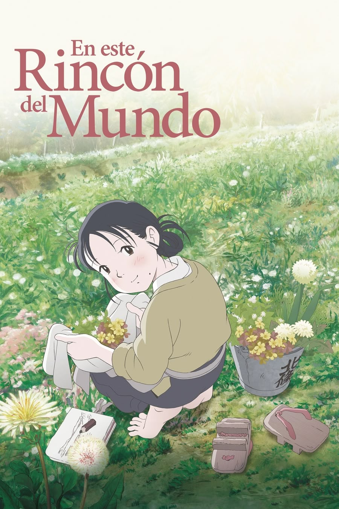 | 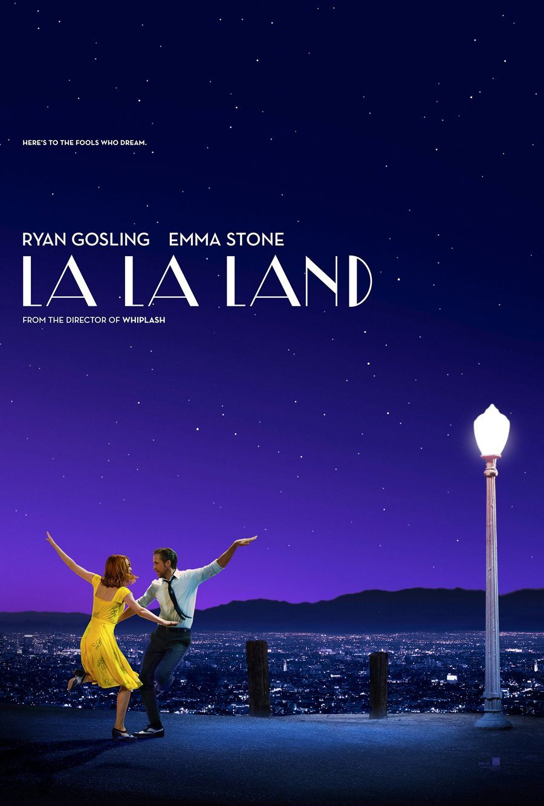 |
| ----------------------------------------------------------- | ------------------------------------------------------- |
| En Este Rincon del Mundo                                    | La La Land                                              |

---

## Educación

- **Bachiller en Humanidades** – U.E. Mariano R. Terrazas (2023)
- **Ingeniería de Sistemas** – Universidad UCATEC (en curso)
