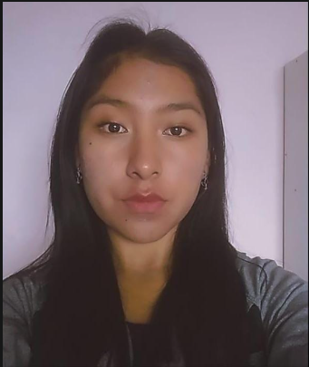
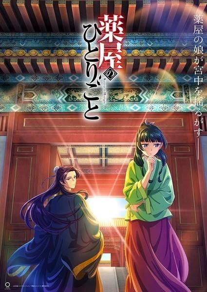

# BIOGRAFIA DE ISABEL  ALEJANDRA QUSPE RAMOS

|| |
|  --------------------------------------- | -----------------------------------------------------------------|
| ¡Hola! soy **Isabel** tengo 19 años y actualmente estoy estudiando la carrera de Ingeniería de sistemas, nací y crecí en Cochabamba-Bolivia, tengo dos hermanos un mayor de 25 años y un menor de 14 años, total en mi familia somos 5.                                    |                                    | 

## Personalidad
- Alegre
- Tranquila
- Optimista
- Amigable 
---

## Pasatiempos y preferencias

### 1. Escuchar música
Entre los temas mas escuchadas ultimamente tenemos:

 - [Tú habitas de Marcos Barrientos](https://music.youtube.com/watch?v=JxwaEd4q0ZA&si=gDUlCA0AYlrkqupo)
 - [Apasionados de Barak](https://music.youtube.com/watch?v=QKD2Bb17ONA&si=qIbfEsXNz96i_Rn7)
- [El santo de Israel de Miel san marcos](https://music.youtube.com/watch?v=CgiT2YjcsSQ&si=7-a2uNWLlB9qnAUg)
- [Grita, canta, danza](https://music.youtube.com/watch?v=IkRp-pFQRg0&si=_265xOH6DTifIlD4)

### 2. Ver animes
Entre los cuales tenemos:

---

|  |  |  |
| --------------------------------------------------------- | ------------------------------------------------------ | -------------------------------------------------------- |
| Dr.Stone                                     | Kuroko no Basket                                  | Los diarios de la boticaria                              |

### 3. Practicar danza
- Contemporánea
- Cristiana 

## Educación
- Nivel inicial **->** U.E. San Francisco II (2011)
- Nivel primaria **->** U.E. San Francisco II (2012017)
- Nivel Secundaria **->** U.E. San Francisco II (2023)
- Universidad **->** U.E. San Francisco II (2025) En curso

