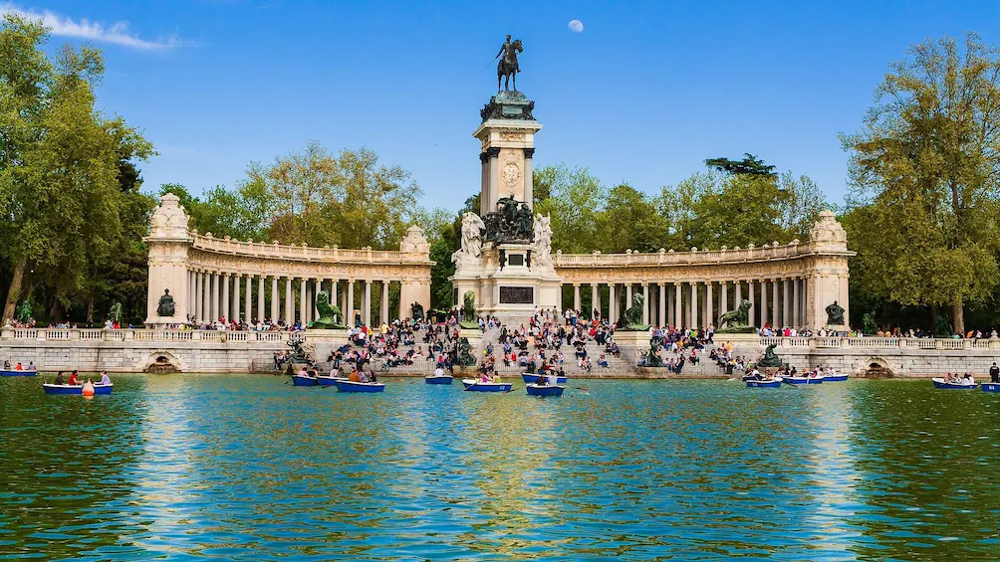
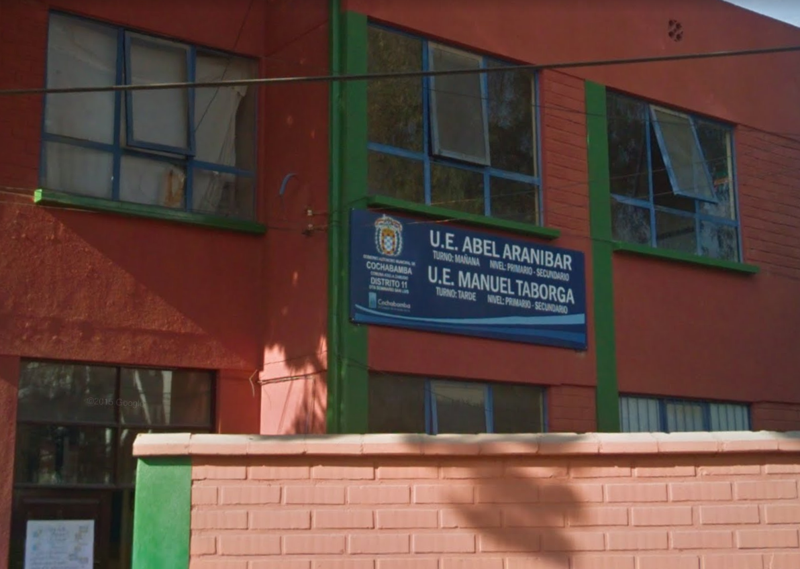
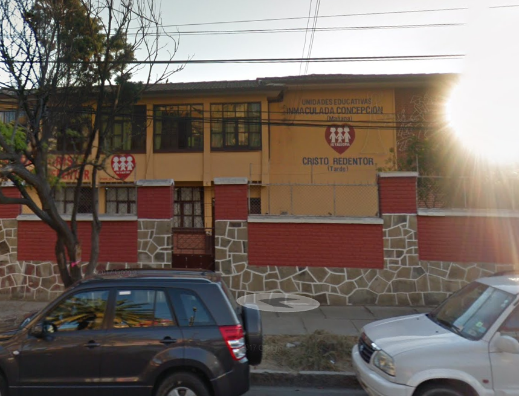
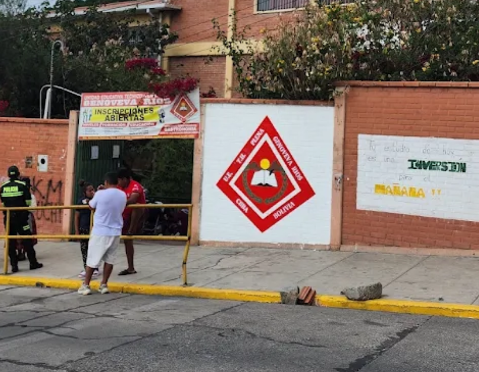
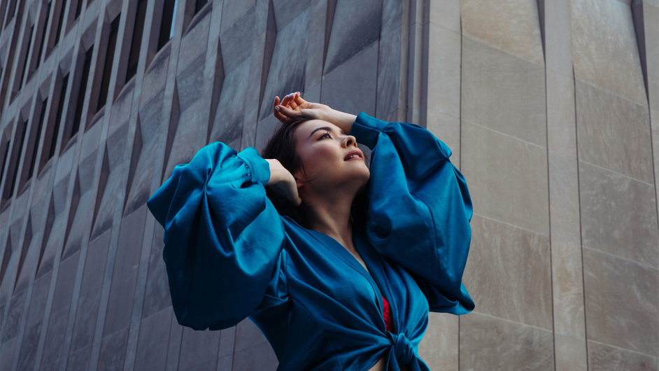
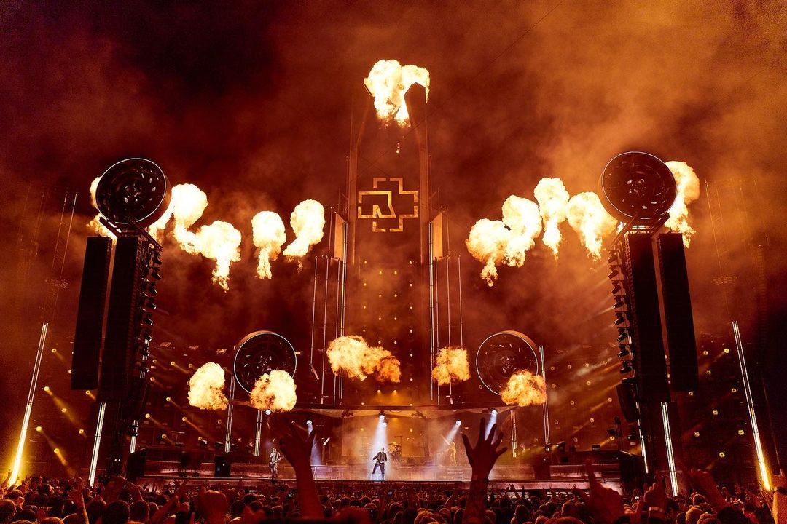
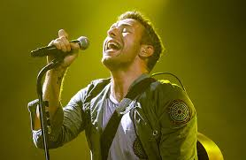
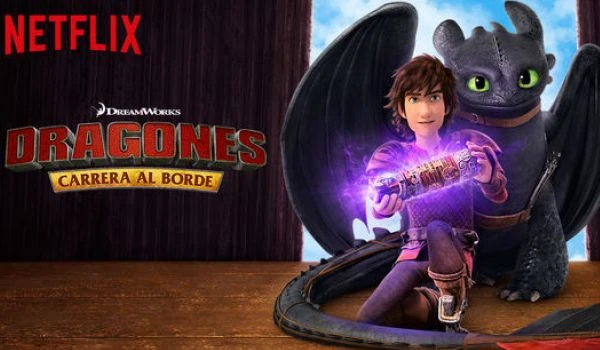
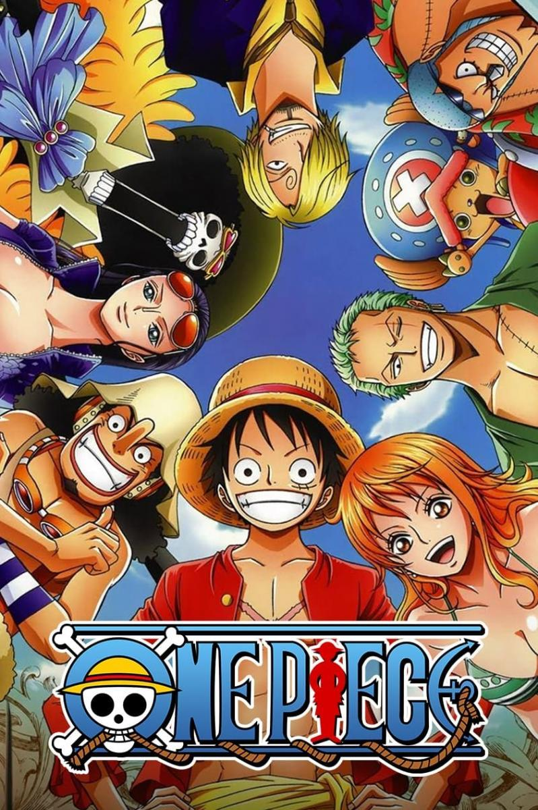

# MI BIBLIOGRAFIA

## Información Personal  
Mi nombre es **Diana Veizaga Manzano**, nací el **29 de agosto de 2005** en la ciudad de **Madrid, España**.  

Mi madre es de **Huanuni** 'Oruro' y mi padre es de **Aiquile** 'Cochabamba'. 
Tengo 2 hermanas menores y 1 hermano mayor.
Vivi por 8 años en España pero al final tuvimos q venir a Cochabamba por q mi abuela estaba enferma lo cual fue algo muy bueno , antes de viajar a Cochabamba nos mudamos a Toledo 
_01.jpg)

Una ciudad muy hermosa con unas casas muy bonitas donde vivi por un año antes de viajar para Bolivia , es un lugar caluroso y bueno para caminar ,por las mañanas si tenias suerte se podia encontrar codornices 
De hay viajamos pa Bolivia algo q me gusto por que pude ver y conocer a mis primos q los considero como hermanos , podia hablar con ellos mas facilmente contarles como estaba y lo q me pasaba de manera mas facil q a mi mama o papa 

Actualmente tengo 19 años y estoy por cumplir 20 años este mes soy estudiante de **Ingeniería en Sistemas** en la Universidad UCATEC.  

### Mascotas 
estos son mis bebes son las cositas por las cuales me esfuerzo y trato de salir adelante zoe y arenita 

## Educación  
Mi camino académico fue muy interesante el primer año 
- **Primaria:** Unidad Educativa *Abel ARanivar* (2011 - 2014).  
 
Un muy buen colegio donde al llegar pude ser la mejor alumna ya q avanzaban cosas faciles para mi pero poco a poco fue complicandose ya q el nivel de exigencia no era el mismo .

   - Unidad Educativa - Cristo Redentor (2014-2016)

    

- **Secundaria:** Genoveva Rios (2016 - 2023).  

El ultimo colegio donde fue bueno y malo algunos profes enseñaban bien y mal no se les entendian o no , o tenian preferncia por algunos estudiantes , pude empezar a hablar con la mayotia de mis compañeros recien en prepromo no fue una bonita experiencia por parte me llegaron a hacer bullyng por lo q era delgada , pero tambien encontre lo q me gusta el dibujo y bailar folclore

- **Universidad:** Ingeniería en Sistemas - UCATEC (2025 - Actualidad).  
Actualmente voy estudiando Ingenieria en Sistemas me gusta algo me va gustando, pero mi sueño era estudiar veterinaria.
Todos los docentes son excelentes , solo con 2 licenciadas me fue mal

## Gustos Musicales 🎵  
La música es algo q me encanta oir musica en el trufi caminando es algo q me encanta las canciones q me gustan en especial son:  
- 	Indie rock – Mistik 

    -  Nobody
- metal industrial – rammstein

  - sonne

- Rock suave – Coldplay  

  - Hymn for the Weekend

## Películas y Series Favoritas 🎬  
Me encanta el cine y algunas de mis 3 pelis favoritas 
- *Avatar* – por sus efectos la trama

- *Avatar 2* 

 .jfif>)
- *La La Land* – es la primera pelicula musical q me encanta y la verdad no me gustan los musicales pero esta es una joya
.jfif>)
  
- Series: *Dragones: carrera al borde*, *One Piece*

## Pasatiempos y Aficiones  
En mi tiempo libre disfruto de muchas actividades que me ayudan a relajarme :  
- Dibujar es algo q me encanta y disfruto de hacer

- Cocinar postres y probar recetas nuevas  
- Me encanta comer la comida es re sabrosa  
- Salir a caminar por lugares tranquilos    

## Metas y Sueños  

Mis objetivos a corto plazo son terminar mi carrera universitaria ,conseguir trabajo y sacar la carrera de veterinaria.
A largo plazo, quisiera poder crear un refugio para los gatitos de la calle  y viajar a diferentes países para aprender de otras culturas y formas de trabajar.  

## Enlaces de Interés  
- [Mi perfil de GitHub](https://github.com/)  
- [UCATEC](https://www.ucatec.edu.bo/)  
- [Mistik Nobody](https://youtu.be/qooWnw5rEcI?si=f3paMEyA527yYGGm9)
- [Cancion de la la land](https://youtu.be/q9TQFZJ2biM?si=9YdqvFVsdFl4w5Bk)  
- [Avatar mi parte favorita ](https://youtu.be/CiQcYpvzYZ4?si=cFs6dsEw9mojrPrw)  
- [Opening 1 de One Piece](https://youtu.be/gcjdXMfYIe4?si=7ckka3DeAdVMVK4Y)  

