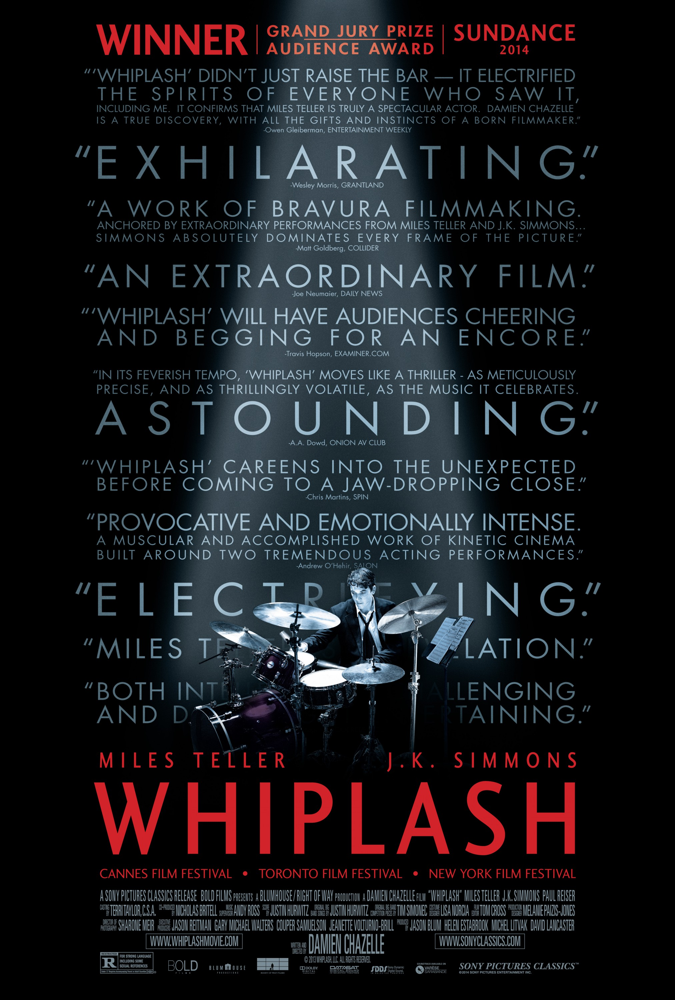

# Mi Biografía

## Sobre mí
Hola, mi nombre es **Juan Manuel Ramallo Soliz** y nací un 12 de febrero del año 2003 en un pequeño pueblo llamado **Alhaurin El Grande, Malaga, España**.

Vivi durante 12 años en España a pesar de que mis padres son de Bolivia, mi padre siendo de **Colquiri en La Paz** y mi madre de **Arani en Cochabamba.**

De niño practique varios deportes como **natacion y tenis**, siendo este ultimo el que mas tiempo jugue y entrene, le dedique casi **7 años** en total, llegando a algunos campeonatos regionales en **Malaga**.

A la edad de **12 años** mis padres decidieron que nos iriamos a vivir a **Cochabamba, Bolivia** a pesar de que esa decision no era de mi agrado al principio, ya que toda mi vida estaba alli.

Al llegar a **Bolivia** encontrar un colegio donde estudiar fue dificil debido a mi lugar de procedencia, ya que algunos colegios no quisieron admitirme, afortunadamente encontramos uno que si y pude seguir estudiando, ya hace **10** años de esto y hasta el momento sigo estudiando.

## Mis estudios
He tenido la oportunidad de estudiar en diferentes instituciones debido a mi familia.

### Etapas de mi educación
1. Escuela primaria en **Colegio Felix Plaza Ramos**
2. Secundaria en **Colegio Santa Ana, Colegio Paulo VI**
3. Carrera universitaria en **UCATEC**

## Intereses
- MUSICA: Principalmente mi genero de musica favorito es el rock de los 80s o 90s, tambien glam rock aunque tambien escucho grupo más alternativos o hasta orquestales.

    Algunas de mis canciones favoritas:

    

    
    
Rockin'1000

    [Rebel Rebel - Live](https://open.spotify.com/intl-es/track/5gjpL4ECE5hRwZR0frzsck?si=16d56ca41ec747f9)

    

    
    
Twenty One Pilots

    [Not Today](https://open.spotify.com/intl-es/track/7qxjGHW485TL8ciwkHD5MK?si=9605d81b1cc042a1)

    [Fake You Out](https://open.spotify.com/intl-es/track/3MLtopC0uho28PxZN7Zecy?si=103b1fb9d0f0444d)

    

    
    
AJR

    [My play](https://open.spotify.com/intl-es/track/6TU3el6rCqHCRepeiCuwj9?si=17d8302688504245)

    [Karma](https://open.spotify.com/intl-es/track/2skZSmKuBgg37tMT2JnZUn?si=bff77fe2d0cf4c2e)

---

- PELICULAS: En cuanto a peliculas mis gustos pueden ser poco comunes en algunos casos, ya que me gustan peliculas inspiradores o que cuentan historias mas reales, aunque debido a mi gran gusto por la musica y las orquestas eso hizo que mis peliculas favoritas esten relacionadas o tengan algo que ver con la musica, un claro ejemplo son:
    
    

    
    

    
    

    
    
Jak and Daxter

    
    
Ratchet and Clank

- DIBUJAR: dibujar es una parte bastante creativa de mi vida, la cual descubri en secundaria, algunos de los dibujos mas especiales que tengo son:

    
    
Eva-01 evangelion

---

### Algunos Sueños
1. Participar o poder tocar con ***Rockin'1000***, el cual es un grupo musical enfocado al rock que esta conformado por 1000 personas para cada concierto, estas personas solicitan unirse cuando dan fecha para un concierto, normalmente hacen los conciertos en portugal, quisiera poder tocar en alguno de sus conciertos, como guitarrista o bateria.
2. Volver al lugar que me vio crecer ***Alhaurin el Grande***, volver a ese lugar seria un gran logro para mi, ya que siempre tendre cierto cariño por ese lugar.

---
**Finalizo con una frase que me inspira mucho.**
> *"LA OBSESIÓN SIEMPRE VENCE AL TALENTO"*

