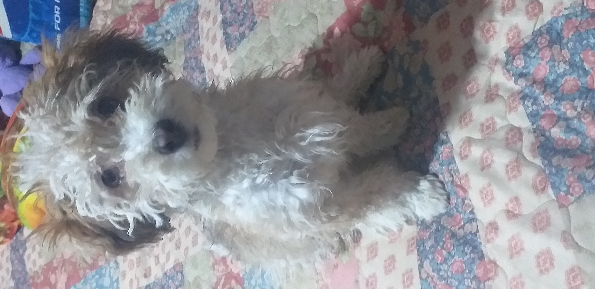

# 🌸​🎀​​ BIBLIOGRAFIA DE *SASHA* 🌸🎀​
Mi nombre es **Denisse Yesenia Soliz Paredes** ,~~yo obligo a que~~ mis amigos me llaman **Sasha** .
Naci en la ciudad de **La Paz - Bolivia** ***the wonderful city*** .
Desde pequeña siempre tuve bastante energia y aspiraciones, mientras mas iba creciendo muchas cosas tomaron sentido para mi, por ejemplo: el dinero.
Me gustaria saber de todo en todo, a veces quisiera ser una especie de  **todologa** pero como diria Socrates:
>solo se que nada se

Mis gustos son bastante variados, tanto en musica, arte, literatura y muchas cosas.

Actualmente vivo con mis padres y no creo que eso vaya a cambiar a menos que encuentre un buen trabajo que me ayude a sustentarme a mi y mis gastos astronomicos como por ejemplo la universidad.  

Tengo **5 mascotas**
-
- **3 PERRITAS**

    - Fly

    - Choka

    - Maggie
    
- **2 loritas**

    - Lechuga y Perica
    

Me gusta mucho todo tipo de musicas como por ejemplo:

- K-pop: https://youtu.be/rkYuufTXkL8?list=LL

- J-pop: https://youtu.be/Xs0Lxif1u9E?list=LL

- Electronica : https://youtu.be/nnAy1906EHg?list=LL

Muchos generos mas que si los pongo todos, esto se haria interminable.

Estudio la carrera de ingeniera en sistemas en la universidad UCATEC por que pienso que la carrera tiene mucho futuro para ser explotado de formas que puedan ayudarme a mi misma a suerarme y tambien ayudar en la sociedad.