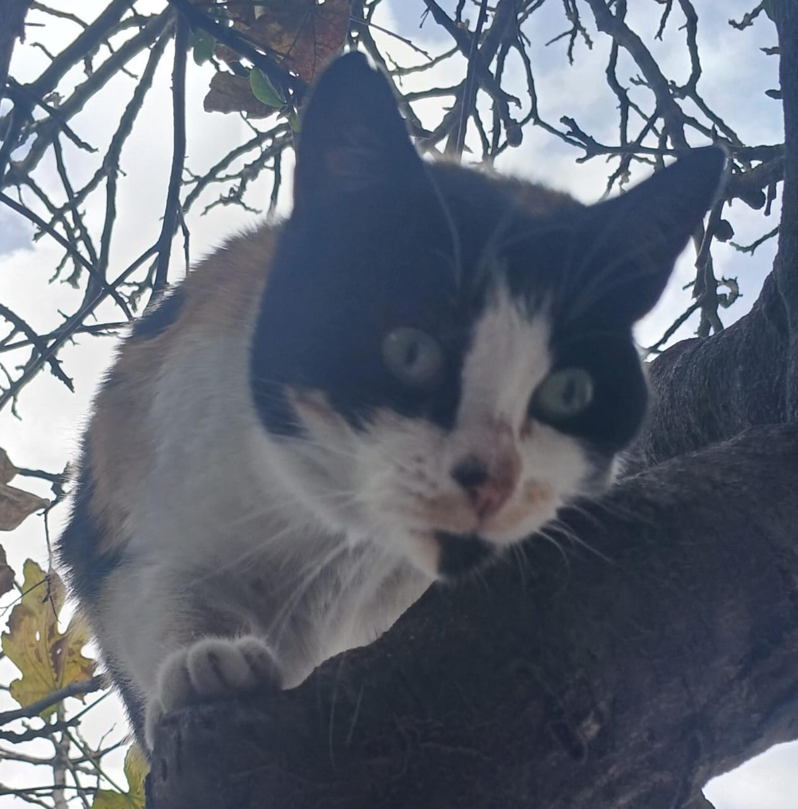
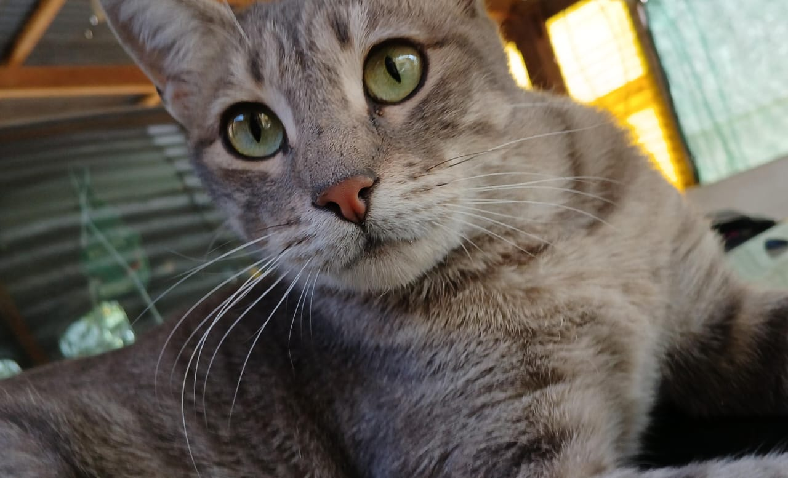

# __Biografía de Jorge Sebastian Torrico Pinto__ 

## Información Personal
- **Nombre completo:** Jorge Sebastian Torrico Pinto
- **Nació el:** 13 de junio de 2005, Cochabamba, Bolivia.
- **Edad:** 20 años.

- **Familia:** 
	- **Madre:** Roxana Pinto Enriquez
	- **Padre:** Carlos Roger Torrico Pinto
	- **Hermana:** Camila Isabel Torrico Pinto

- **Mascotas:** 
	- **Rubí** Gato (lol), 6 años.
    
	- **Donny** Perrito mestizo blanco de 3 meses.
    
    - **Sabi:** Gata gris atigrada de 7 años.
  

## Educación
1.  **Colegio:** Bachiller 2022 colegio Pedro Poveda
2. **Estudiante Universitaria:** Estudiante Regular de la Universidad Privada de Ciencias Administrativas y Tecnológicac (UCATEC). 

## Hobbies e Intereses
- Ir al gym, ciclismo, caminata con música  
- Ver series, favoritas: Breaking Bad, Better Call Saul, Daredevil
- Dibujar de forma tradicional, pintar con acuarellas.
- Escribir y componer música
- Tocar intrumentos (guitarra, guitarra electrica, ukelele, teclado, bajo)

## Música
- Michael Jackson
- My Chemical Romance
- Radiohead
- Linkin Park
- Charly Garcia
- Gustavo Cerati
- The Beatles+

## Redes y Contacto
- [GitHub](https://github.com/torricoseba "torricoseba") - Pefil basico de aprendizaje a futuro profesional.
- **Email:** torrico.pinto.sebastian@gmail.com (Personal e institucional).
- **Numero de contacto:** +591 71478102
