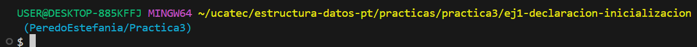

# **INDICE**

* [1. Descripcion](#1-descripcion)
  * [1.1. Ejercicio 1: Factorial de un número](#11-ejercicio-1-factorial-de-un-número)
  * [1.2. Ejercicio 2: Fibonacci](#12-ejercicio-2-fibonacci)
  * [1.3. Ejercicio 3: Suma de dígitos](#13-ejercicio-3-suma-de-dígitos)
  * [1.4. Ejercicio 4: Potencia de un número](#14-ejercicio-4-potencia-de-un-número)
  * [1.5. Ejercicio 5: Invertir cadena](#15-ejercicio-5-invertir-cadena)
  * [1.6. Ejercicio 6: Máximo común divisor (MCD)](#16-ejercicio-6-máximo-común-divisor-mcd)
  * [1.7. Ejercicio 7: Suma de un arreglo](#17-ejercicio-7-suma-de-un-arreglo)
  * [1.8. Ejercicio 8: Número binario](#18-ejercicio-8-número-binario)
  * [1.9. Ejercicio 9: Palíndromo](#19-ejercicio-9-palíndromo)
  * [1.10. Ejercicio 10: Torres de Hanoi](#110-ejercicio-10-torres-de-hanoi)
---

# 1. Descripcion

En este documento se explican los diferentes ejercicios de **recursividad en C#** que forman parte de la **Práctica 3** de la materia **Estructura de Datos**.
Cada ejercicio muestra cómo aplicar funciones recursivas para resolver problemas clásicos.

* **Ejecución:**

1. Entramos a la carpeta del ejercicio en la terminal, como se ve en la imagen:
   
2. Ejecutamos el siguiente comando:

   <pre>
   dotnet run</pre>

**Estilo de nombrado:**

* **Clases** → PascalCase (`Ejercicio1`)
* **Variables** → snake_case (`num`, `resultado`)
* **Métodos** → PascalCase (`CalcularFactorial`, `EsPalindromo`)

---

## 1.1. Ejercicio 1: Factorial de un número

Calcula el factorial de un número dado usando recursividad.

**Flujo del programa:**

1. El usuario ingresa un número `n`.
2. Se aplica la función recursiva:
   *Caso base:* si `n == 0` o `n == 1`, devuelve 1.
   *Paso recursivo:* `n * factorial(n-1)`.

---

## 1.2. Ejercicio 2: Fibonacci

Calcula el término `n` de la serie de Fibonacci.

**Flujo del programa:**

1. El usuario ingresa el valor `n`.
2. La función recursiva retorna:
   *Caso base:* si `n == 0` devuelve 0, si `n == 1` devuelve 1.
   *Paso recursivo:* `Fibonacci(n-1) + Fibonacci(n-2)`.

---

## 1.3. Ejercicio 3: Suma de dígitos

Suma los dígitos de un número entero.

**Flujo del programa:**

1. El usuario ingresa un número.
2. Se separa el último dígito con `% 10` y se suma al resto (`/ 10`).
3. Se llama recursivamente hasta que el número sea 0.

---

## 1.4. Ejercicio 4: Potencia de un número

Calcula `a^b` mediante recursividad.

**Flujo del programa:**

1. Se pide base `a` y exponente `b`.
2. Caso base: si `b == 0`, devuelve 1.
3. Paso recursivo: `a * Potencia(a, b-1)`

---

## 1.5. Ejercicio 5: Invertir cadena

Invierte una cadena de texto de forma recursiva.

**Flujo del programa:**

1. El usuario ingresa una cadena.
2. Caso base: si la longitud es 0 o 1, devuelve la misma cadena.
3. Paso recursivo: toma el último carácter y lo concatena con la inversión del resto.

---

## 1.6. Ejercicio 6: Máximo común divisor (MCD)

Encuentra el MCD de dos números con el algoritmo de Euclides recursivo.

**Flujo del programa:**

1. Se piden dos números `a` y `b`.
2. Caso base: si `b == 0`, devuelve `a`.
3. Paso recursivo: `MCD(b, a % b)`.

---

## 1.7. Ejercicio 7: Suma de un arreglo

Suma todos los elementos de un arreglo con recursividad.

**Flujo del programa:**

1. El usuario define el tamaño del arreglo y lo llena.
2. Caso base: si queda un solo elemento, lo devuelve.
3. Paso recursivo: `arr[0] + suma(resto)`.

---

## 1.8. Ejercicio 8: Número binario

Convierte un número decimal en binario.

**Flujo del programa:**

1. Se pide un número entero.
2. Caso base: si el número es 0 o 1, se imprime.
3. Paso recursivo: divide entre 2 y guarda el residuo.

---

## 1.9. Ejercicio 9: Palíndromo

Verifica si una cadena es un palíndromo.

**Flujo del programa:**

1. Se pide una cadena al usuario.
2. Caso base: si la longitud es 0 o 1, es palíndromo.
3. Paso recursivo: compara primer y último carácter y llama a la función con la subcadena restante.

---

## 1.10. Ejercicio 10: Torres de Hanoi

Resuelve el problema de mover discos entre tres torres.

**Flujo del programa:**

1. Se pide el número de discos.
2. Caso base: si hay un solo disco, se mueve directamente.
3. Paso recursivo: mueve `n-1` discos al auxiliar, mueve el disco mayor al destino y luego los `n-1` restantes al destino.