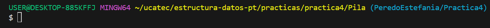

# **INDICE**

* [1. Descripcion](#1-descripcion)
  * [1.1. Insertar al principio en una lista simple](#11-insertar-al-principio-en-una-lista-simple)
  * [1.2. Eliminar alrededor de un valor en la lista](#12-eliminar-alrededor-de-un-valor-en-la-lista)

---

# 1. Descripcion

En esta práctica se implementan **listas simplemente enlazadas** en C#, aplicando operaciones básicas de inserción y eliminación.

* **Archivos incluidos en esta práctica:**

  * `Nodo.cs` → Define la clase `Nodo` con el valor y la referencia al siguiente.
  * `ListaSimple.cs` → Contiene los métodos para insertar y eliminar.
  * `Program.cs` → Contiene el menú principal para probar las funcionalidades.

* **Ejecución:**

1. Entramos a la carpeta de la práctica en la terminal como se ve en la imagen:
 
2. Ejecutamos el comando:

   <pre>
   dotnet run</pre>

**Estilo de nombrado:**

* **Clases** → PascalCase (`Nodo`, `ListaSimple`)
* **Variables** → camelCase (`valor`, `actual`)
* **Métodos** → PascalCase (`InsertarInicio`, `EliminarAlrededor`)

---

## 1.1. Insertar al principio en una lista simple

Permite insertar nombres al inicio de la lista.
Cada nuevo nodo apunta al anterior primer nodo, manteniendo la cadena de referencias.

**Flujo del programa:**

1. El usuario ingresa un nombre.
2. Se crea un nuevo nodo con ese valor.
3. El nuevo nodo apunta al anterior inicio de la lista.
4. La lista actualiza su referencia al nuevo nodo como primer elemento.

**Métodos usados:**

* Clase `Nodo` con atributos: `string name`, `Nodo siguiente`.
* Método `InsertarInicio(string nombre)`.

---

## 1.2. Eliminar alrededor de un valor en la lista

Permite eliminar el nodo **anterior y posterior** a un valor específico dentro de la lista.

**Flujo del programa:**

1. El usuario ingresa un nombre que se desea buscar en la lista.
2. Si el nombre existe:
   * Se elimina el nodo anterior a este valor (si existe).
   * Se elimina también el nodo posterior (si existe).
3. Si el nombre está al inicio o al final, solo se elimina el que corresponde (no hay anterior o posterior).

**Métodos usados:**

* Búsqueda secuencial en la lista.
* Referencias para "saltar" nodos (`anterior.siguiente = actual.siguiente`).
* Método `EliminarAlrededor(string nombre)`.

---
