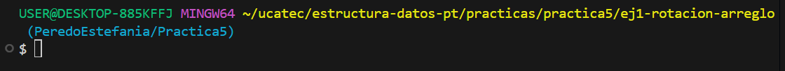

# **INDICE**

* [1. Descripcion](#1-descripcion)
  * [1.1. Rotación de un arreglo](#11-rotación-de-un-arreglo)
  * [1.2. Algoritmo de Kadane](#12-algoritmo-de-kadane)
  * [1.3. Eliminar duplicados](#13-eliminar-duplicados)
  * [1.4. Encontrar número faltante](#14-encontrar-número-faltante)
  * [1.5. Intersección de dos arreglos](#15-intersección-de-dos-arreglos)
  * [1.6. Matriz transpuesta](#16-matriz-transpuesta)
  * [1.7. Producto sin incluir índice](#17-producto-sin-incluir-índice)
  * [1.8. Buscar en arreglo rotado](#18-buscar-en-arreglo-rotado)
  * [1.9. Recorrido en espiral de una matriz](#19-recorrido-en-espiral-de-una-matriz)
  * [1.10. Suma de subconjuntos](#110-suma-de-subconjuntos)

---

# 1. Descripcion

En este documento se explican los ejercicios de **arreglos y matrices avanzados en C#**.
Cada ejercicio se ejecuta en consola, mostrando el uso de **arreglos, matrices, algoritmos de búsqueda y optimización**.

* **Ejecucion:**

1. Entramos a la carpeta del ejercicio en la terminal como se ve en la imagen:

2. Ejecutamos el comando:

   <pre>
   dotnet run
   </pre>

**Estilo de nombrado:**

* **Clases** → PascalCase (`Ejercicio5`)
* **Variables** → camelCase (`numArray`, `matrizTranspuesta`)

---

## 1.1. Rotación de un arreglo

**Flujo del programa:**

1. Se define un arreglo inicial.
2. El usuario indica cuántas posiciones rotar.
3. Se desplazan los elementos hacia la derecha o izquierda.
4. Se muestra el arreglo resultante.

**Métodos usados:**

* Bucle `for`
* Uso de índices y desplazamientos

---

## 1.2. Algoritmo de Kadane

**Flujo del programa:**

1. Se inicializa la suma actual y la máxima en 0.
2. Se recorre el arreglo sumando cada valor.
3. Si la suma actual es negativa, se reinicia en 0.
4. Se guarda la mayor suma encontrada.
5. Se imprime el resultado.

**Métodos usados:**

* Ciclo `for`
* Variables acumuladoras

---

## 1.3. Eliminar duplicados

**Flujo del programa:**

1. Se recibe un arreglo con valores repetidos.
2. Se insertan los valores en un `HashSet` (evita duplicados).
3. Se convierte el conjunto nuevamente en arreglo.
4. Se imprime el resultado sin duplicados.

**Métodos usados:**

* `HashSet`
* `foreach`

---

## 1.4. Encontrar número faltante

**Flujo del programa:**

1. Se recibe un arreglo con números consecutivos excepto uno.
2. Se calcula la suma esperada con la fórmula de Gauss.
3. Se calcula la suma real del arreglo.
4. La diferencia es el número faltante.

**Métodos usados:**

* Fórmula matemática
* Bucle `for`

---

## 1.5. Intersección de dos arreglos

**Flujo del programa:**

1. Se reciben dos arreglos.
2. Se convierten en conjuntos (`HashSet`).
3. Se comparan los elementos comunes.
4. Se muestra la intersección.

**Métodos usados:**

* `HashSet`
* `Contains`

---

## 1.6. Matriz transpuesta

**Flujo del programa:**

1. Se recibe una matriz de tamaño m×n.
2. Se crea una nueva matriz de tamaño n×m.
3. Se intercambian filas por columnas.
4. Se muestra la matriz transpuesta.

**Métodos usados:**

* Bucles `for` anidados
* Acceso con índices `matriz[i, j]`

---

## 1.7. Producto sin incluir índice

**Flujo del programa:**

1. Se recibe un arreglo numérico.
2. Para cada índice, se multiplica todo el arreglo excepto ese valor.
3. Se guarda el resultado en un nuevo arreglo.
4. Se imprime el arreglo resultante.

**Métodos usados:**

* Ciclo `for`
* Multiplicación acumulada

---

## 1.8. Buscar en arreglo rotado

**Flujo del programa:**

1. Se recibe un arreglo ordenado pero rotado.
2. Se aplica búsqueda binaria modificada.
3. Se determina si buscar en mitad izquierda o derecha.
4. Se imprime si el valor fue encontrado.

**Métodos usados:**

* Búsqueda binaria
* Condicionales

---

## 1.9. Recorrido en espiral de una matriz

**Flujo del programa:**

1. Se recibe una matriz m×n.
2. Se definen los límites superior, inferior, izquierdo y derecho.
3. Se recorre primero la fila superior, luego la columna derecha, después la fila inferior y finalmente la columna izquierda.
4. Se reducen los límites y se repite hasta terminar.

**Métodos usados:**

* Bucles `while` y `for`
* Variables de control de límites

---

## 1.10. Suma de subconjuntos

**Flujo del programa:**

1. Se recibe un arreglo y una suma objetivo.
2. Se intenta formar subconjuntos de manera recursiva.
3. Si la suma parcial es igual al objetivo, se confirma solución.
4. Se muestra el resultado.

**Métodos usados:**

* Recursividad
* Condicionales

---