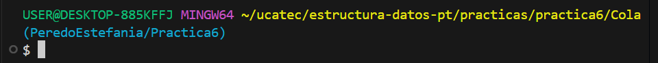

# Práctica 6: Implementación de Colas en C#

## Descripción

Este proyecto implementa la estructura de datos **Cola (Queue)** en C# de manera básica, utilizando un **arreglo de caracteres (`char[]`)** sin depender de `System.Collections.Generic`

La cola funciona como una **cola circular**, donde los elementos se insertan por el final (**Rear**) y se eliminan por el frente (**Front**), siguiendo el principio **FIFO (First In, First Out)**

El programa permite al usuario interactuar con la cola mediante un **menú en consola**, donde se pueden realizar operaciones comunes como agregar, eliminar, consultar y verificar estados de la cola

---
## **Estilo de nombrado:**

* **Clases** → PascalCase (`Nodo`, `ListaSimple`)
* **Variables** → snake_case (`valor`, `actual`)
* **Métodos** → PascalCase (`InsertarInicio`, `EliminarAlrededor`)
---

## Archivos

### 1. `MyQueue.cs`

Contiene la clase **MyQueue**, que define la cola circular con las siguientes variables miembro:

* `Size` → Tamaño máximo de la cola
* `Front` → Índice del primer elemento
* `Rear` → Índice del último elemento
* `Count` → Número actual de elementos
* `Elements` → Arreglo de tipo `char` que almacena los elementos

#### Métodos Implementados

1. `Mostrar()` → Muestra el contenido de la cola
2. `Enqueue(char item)` → Inserta un elemento al final
3. `Dequeue()` → Elimina y devuelve el elemento del frente
4. `Peek()` → Devuelve el elemento al frente sin eliminarlo
5. `GetCount()` → Devuelve la cantidad actual de elementos
6. `GetSize()` → Devuelve el tamaño máximo de la cola
7. `Contains(char item)` → Verifica si un elemento está en la cola
8. `IsEmpty()` → Verifica si la cola está vacía
9. `IsFull()` → Verifica si la cola está llena

---

### 2. `Program.cs`

Contiene el programa principal con un menú interactivo que permite al usuario:

1. Mostrar la cola.
2. Agregar un elemento (Enqueue).
3. Eliminar un elemento (Dequeue).
4. Ver el frente de la cola (Peek).
5. Ver la cantidad de elementos (Count).
6. Ver el tamaño máximo de la cola (Size).
7. Buscar un elemento en la cola (Contains).
8. Verificar si está vacía.
9. Verificar si está llena.
10. Salir.

---

## Ejecución del Programa

### 1. **Ubicación:**
Entramos a la carpeta de la práctica en la terminal como se ve en la imagen:
 
### 2. **Ejecución:** 
Ejecute el siguiente comando:

   <pre>
   dotnet run</pre>

### 3. **Ejemplo de Ejecución**

<pre>
Ingrese el tamaño de la cola: 5

--- MENÚ ---
1. Mostrar cola
2. Agregar elemento a la cola
3. Eliminar elemento de la cola
4. Ver frente de la cola
5. Ver cantidad de elementos en la cola
6. Ver tamaño de la cola
7. Buscar elemento en la cola
8. Ver si está vacía
9. Ver si está llena
0. Salir
Seleccione una opción: 2
Ingrese un carácter para agregar: A

Seleccione una opción: 1
Cola: A
</pre>