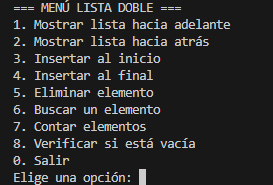

# Lista Doble Enlazada en C#

## Índice

- [Lista Doble Enlazada en C#](#lista-doble-enlazada-en-c)
  - [Índice](#índice)
  - [Descripción](#descripción)
  - [Compilación y Ejecución](#compilación-y-ejecución)
  - [Menú mostrado por consola](#menú-mostrado-por-consola)
  - [Casos de Uso y Ejemplos](#casos-de-uso-y-ejemplos)
    - [1. Mostrar lista hacia adelante](#1-mostrar-lista-hacia-adelante)
    - [2. Mostrar lista hacia atrás](#2-mostrar-lista-hacia-atrás)
    - [3. Insertar al inicio](#3-insertar-al-inicio)
    - [4. Insertar al final](#4-insertar-al-final)
    - [5. Eliminar elemento](#5-eliminar-elemento)
    - [6. Buscar un elemento](#6-buscar-un-elemento)
    - [7. Contar elementos](#7-contar-elementos)
    - [8. Verificar si está vacía](#8-verificar-si-está-vacía)
    - [9. LimpiarPantalla()](#9-limpiarpantalla)

---

## Descripción

Este proyecto implementa una lista doblemente enlazada en C# con operaciones básicas como inserción, eliminación, búsqueda y recorrido en ambos sentidos.


## Compilación y Ejecución

Desde la carpeta `listas-dobles` ejecuta:

```sh
dotnet run
```

---
## Menú mostrado por consola


## Casos de Uso y Ejemplos

### 1. Mostrar lista hacia adelante

  Recorre y muestra los elementos de la lista desde el inicio hasta el final.


**Opción:** 1  
**Ejemplo de salida:**
```
Lista hacia adelante: 10 20 30
```

### 2. Mostrar lista hacia atrás

  Recorre y muestra los elementos de la lista desde el final hasta el inicio.


**Opción:** 2  
**Ejemplo de salida:**
```
Lista hacia atrás: 30 20 10
```

### 3. Insertar al inicio

  Inserta un nuevo nodo al inicio de la lista si el valor no existe.


**Opción:** 3  
**Entrada:**  
```
Ingrese el dato: 10
```
**Salida:**  
```
Elemento 10 insertado al inicio.
```

### 4. Insertar al final

  Inserta un nuevo nodo al final de la lista si el valor no existe.


**Opción:** 4  
**Entrada:**  
```
Ingrese el dato: 30
```
**Salida:**  
```
Elemento 30 insertado al final.
```

### 5. Eliminar elemento

  Elimina el primer nodo que contenga el valor especificado.


**Opción:** 5  
**Entrada:**  
```
Ingrese el valor a eliminar: 20
```
**Salida si existe:**  
```
Elemento 20 eliminado.
```
**Salida si no existe:**  
```
Elemento no encontrado.
```

### 6. Buscar un elemento
  Busca un elemento en la lista y muestra su posición si existe.


**Opción:** 6  
**Entrada:**  
```
Ingrese el elemento a buscar: 10
```
**Salida si existe:**  
```
Elemento 10 encontrado en la posición 1.
```
**Salida si no existe:**  
```
Elemento 10 no encontrado en la lista.
```

### 7. Contar elementos

  Devuelve la cantidad de elementos en la lista.


**Opción:** 7  
**Salida:**  
```
La lista tiene 3 elementos.
```

### 8. Verificar si está vacía

  Indica si la lista está vacía.

**Opción:** 8  
**Salida si vacía:**  
```
La lista está vacía.
```
**Salida si no está vacía:**  
```
La lista tiene elementos.
```
---

***¡¡¡Metodo extra!!!***
  
### 9. LimpiarPantalla() 
  Pausa la ejecución y limpia la consola.

