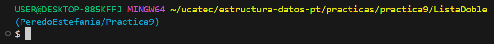

# **INDICE**

* [1. Descripción](#1-descripción)
  * [1.1. Lista Doble](#11-lista-doble)

---

# 1. Descripción

En esta práctica se implementa una **lista doblemente enlazada** en C#, con nodos que tienen referencias al siguiente y al anterior.  
El programa permite insertar, eliminar, buscar y recorrer elementos de la lista tanto hacia adelante como hacia atrás mediante un menú interactivo.

* **Ejecución:**

1. Abrimos la carpeta del proyecto en la terminal  
   
2. Ejecutamos el comando:
  <pre>
  dotnet run </pre>

**Estilo de nombrado:**
- **Clases** → PascalCase (`ListaDoble`, `Nodo`)
- **Métodos** → PascalCase (`InsertarAlInicio`, `Buscar`, `Eliminar`)
- **Variables** → snake_case (`cabeza`, `cola`, `temp`, `op`)

---

## 1.1. Lista Doble

El menú implementado tiene las siguientes opciones:

1. **Mostrar lista hacia adelante** → Recorre la lista desde la cabeza hasta la cola.  
2. **Mostrar lista hacia atrás** → Recorre la lista desde la cola hasta la cabeza.  
3. **Insertar al inicio** → Inserta un nuevo nodo al comienzo de la lista.  
4. **Insertar al final** → Inserta un nuevo nodo al final de la lista.  
5. **Eliminar elemento** → Elimina un nodo por su valor.  
6. **Buscar elemento** → Busca un nodo en la lista y muestra su posición.  
7. **Cantidad de elementos** → Devuelve el número de nodos en la lista.  
8. **Verificar si está vacía** → Indica si la lista no contiene nodos.  
0. **Salir** → Finaliza la ejecución del programa.  

### **Flujo del programa:**
1. Se inicializa la lista vacía.  
2. El usuario selecciona una opción del menú.  
3. Dependiendo de la opción, se ejecuta la acción correspondiente sobre la lista.  
4. El menú se repite hasta que el usuario elige salir.  

### **Métodos implementados en `ListaDoble`:**
- `MostrarAdelante()`  
- `MostrarAtras()`  
- `InsertarAlInicio(string nombre)`  
- `InsertarAlFinal(string nombre)`  
- `Eliminar(string nombre)`  
- `Buscar(string nombre)`  
- `Cantidad()`  
- `EstaVacia()`  
