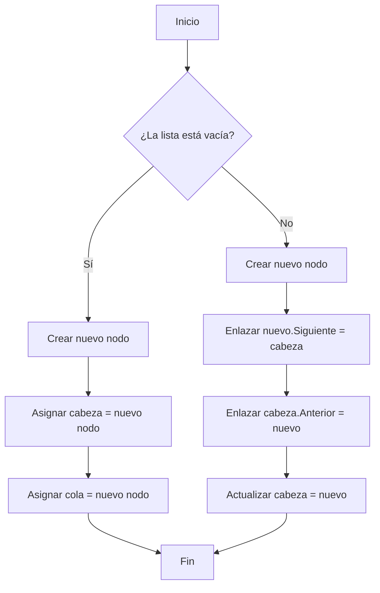

**INDICE**
- [Documentación de la práctica 9 de listas dobles](#documentación-de-la-práctica-9-de-listas-dobles)
  - [1. Clase NodoDoble](#1-clase-nododoble)
  - [2. Clase ListasDobles](#2-clase-listasdobles)
    - [2.1. Métodos principales](#21-métodos-principales)
      - [2.1.1. Mostrar lista](#211-mostrar-lista)
      - [2.1.2. Inserciones](#212-inserciones)
      - [2.1.3. Eliminaciones](#213-eliminaciones)
      - [2.1.4. Operaciones adicionales](#214-operaciones-adicionales)
  - [3. Clase Program](#3-clase-program)
  - [4. Salida esperada](#4-salida-esperada)
    - [4.1.  Algunos ejemplos de ejecución](#41--algunos-ejemplos-de-ejecución)
  - [5. Diagrama de flujo](#5-diagrama-de-flujo)

# Documentación de la práctica 9 de listas dobles

Este proyecto implementa una Lista Doblemente Enlazada en C#, una estructura de datos dinámica donde cada nodo tiene una referencia tanto al siguiente como al anterior nodo. Esto permite recorrer la lista en ambas direcciones y facilita operaciones de inserción y eliminación.

Esta práctica sigue las siguientes convenciones de nombres:

- Clases y métodos → PascalCase

- Variables locales y parámetros → camelCase

--- 

## 1. Clase NodoDoble

Esta clase representa un elemento de la lista, el cual gracias a ello se puede recorrer la lista hacia adelante y hacia atrás.

**Archivo:** [`nodo-doble/Program.cs`](https://github.com/pum3ucatec/estructura-datos-pt/blob/QuispeIsabel/Practica9/practicas/practica9/listas-dobles/nodo-doble.cs)

- `Dato`: Almacena el valor.
- `Siguiente`: Apunta al proximo nodo.
- `Anterior`: Apunta al nodo anterior.

## 2. Clase ListasDobles

Esta clase contiene la lógica de la lista.

- `cabeza`: Que es el primer nodo de la lista.
- `cola`: Es el último nodo de la lista.

**Archivo:** [`listas-dobles.cs`](https://github.com/pum3ucatec/estructura-datos-pt/blob/QuispeIsabel/Practica9/practicas/practica9/listas-dobles/listas-dobles.cs)

### 2.1. Métodos principales

#### 2.1.1. Mostrar lista

- `MostrarHaciaAdelante()` → imprime desde la cabeza hasta la cola.

- `MostrarHaciaAtras()` → imprime desde la cola hasta la cabeza.

#### 2.1.2. Inserciones

- `InsertarAlInicio(int dato)` → agrega un nodo al inicio.

- `InsertarAlFinal(int dato)` → agrega un nodo al final.

#### 2.1.3. Eliminaciones

- `EliminarAlInicio()` → elimina el primer nodo.

- `EliminarAlFinal()` → elimina el último nodo.

- `EliminarEnPosicion(int posicion)` → elimina un nodo en una posición específica (usando recorrido).

#### 2.1.4. Operaciones adicionales

- `Buscar(int dato)` → encuentra un valor y devuelve su posición.

- `Contar()` → devuelve la cantidad de nodos.

- `EstaVacia()` → indica si la lista está vacía.

- `Vaciar()` → elimina todos los nodos.

---

## 3. Clase Program

Esta clase contiene un menú que permite a usuario probar todas las operaciones de la lusta doble.

- Las opciones van desde mostrar la lista, insertar y eliminar, hasta contar, buscar y vaciar.

- El bucle do-while asegura que el menú se repita hasta que se elija la opción 0 (Salir).
  
**Archivo:** [`Program/Program.cs`](https://github.com/pum3ucatec/estructura-datos-pt/blob/QuispeIsabel/Practica9/practicas/practica9/listas-dobles/Program.cs)

## 4. Salida esperada

         === MENÚ LISTA DOBLE ===
         1. Mostrar lista hacia adelante
         2. Mostrar lista hacia atrás
         3. Insertar al inicio
         4. Insertar al final 
         5. Eliminar al inicio
         6. Eliminar al final
         7. Eliminar en una posición específica
         8. Buscar un elemento
         9. Contar elementos
         10. Verificar si está vacía
         11. Vaciar lista
         0. Salir
         Elige una opción:

### 4.1.  Algunos ejemplos de ejecución

Supongamos que ya ingresaron esos datos por consola
  

   - Mostar lista
          
          Elige una opción: 1
          Lista hacia adelante:5<->6<->9<->1<->null

   - Eliminar de una posición especifica

          Elige una opción: 7
          Ingrese la posición a eliminar: 3
          Nodo en la posición 3 eliminado.

  - Buscar un elemento

          Elige una opción: 8
          Ingrese el elemento a buscar: 5
          Elemento 5 no encontrado en la lista.

   - Contar elementos 
  
          Elige una opción: 9
          La lista tiene 3 elementos.

---

## 5. Diagrama de flujo

